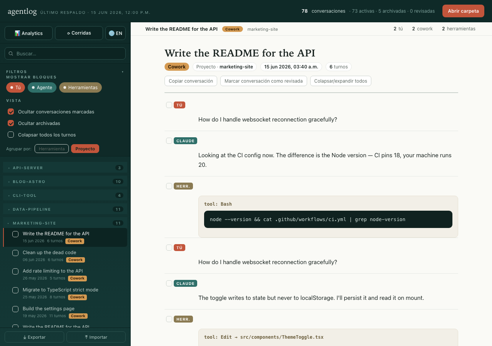
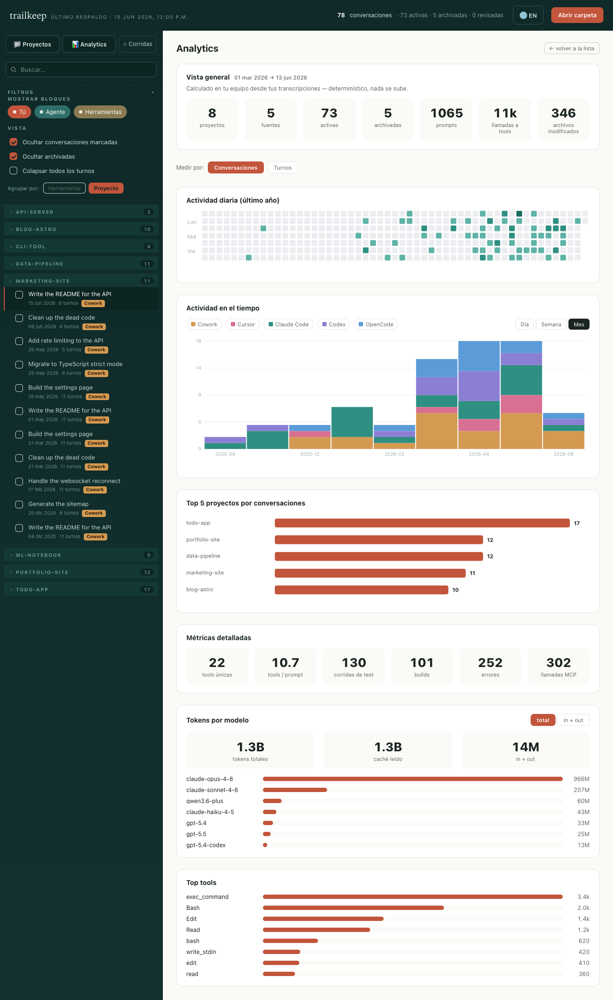
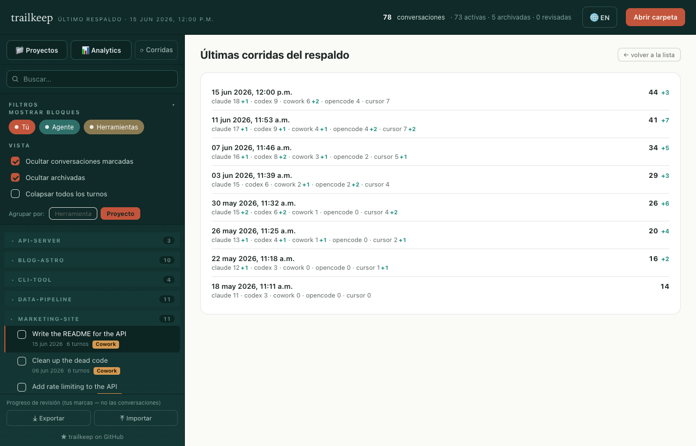

# trailkeep

**Guardá tu historial de coding con IA — privado, navegable y tuyo.**

**🇪🇸 Español · 🇬🇧 [English](README.md)**

Un lugar local para tus conversaciones con tus herramientas de coding con IA — la
que uses. Guardá las decisiones y el contexto que tu código no registra,
encontralo después y retomá donde quedaste. Nada sale de tu máquina.

Este proyecto lee dónde cada herramienta guarda sus sesiones en tu disco, las
convierte a Markdown legible con metadata estándar, y te da un visor HTML
standalone para navegarlas, agruparlas, filtrarlas y ver analíticas de tu uso.

Todo corre **localmente en tu Mac**. Nada se sube a ningún lado. La interfaz del
visor es **bilingüe (inglés / español)** con un selector de idioma.

**▶ [Probá la demo en vivo](https://lucasgday.github.io/trailkeep/)** — el visor
corriendo en tu navegador con datos de ejemplo, para ver cómo funciona. **No sube
nada.**


---

## Por qué

**Tus chats de coding con IA guardan las decisiones y el *por qué* de cómo hiciste
las cosas — contexto que tu código no registra. Pero vive encerrado en el formato
de cada herramienta, difícil de releer, y tus herramientas no lo conservan para
siempre:**

- **Claude Code** limpia transcripts viejos pasado un tiempo (por defecto, según
  la última actividad). Es **configurable**: subiendo `cleanupPeriodDays` en
  `~/.claude/settings.json` podés extender mucho la retención o, en la práctica,
  desactivarla. Pero si no lo tocaste, estás en el default y las sesiones viejas
  desaparecen.
- **Codex** guarda archivos locales de sesión, pero el agrupamiento por proyecto
  y sidebar de la app puede cambiar con el tiempo. Un backup en Markdown te deja
  una copia estable y buscable fuera de la UI.
- Cada herramienta tiene su propia política, su propio formato y su propio
  alcance. Y si reinstalás, cambiás de máquina, corrés un `rm` o se corrompe una
  base de datos, ese historial se va **sin aviso** y sin papelera.

> **Nota honesta:** si usás *solo* Claude Code y subís `cleanupPeriodDays`, gran
> parte del borrado automático deja de ser un problema. Aun así, trailkeep sigue
> aportando lo que un setting de retención no te da (ver abajo).

Lo que este proyecto te da, más allá de la retención de cada herramienta:

- **Una copia durable y aparte.** Acumulativa: una vez respaldada, una
  conversación **nunca se borra de tu copia**, aunque la herramienta de origen la
  elimine, reinstales o migres de máquina.
- **Funciona con las herramientas que uses.** Una o varias — Claude Code, Codex,
  Cowork, OpenCode y Cursor — todas en un mismo lugar y formato.
- **Algo navegable de verdad.** Markdown legible + un visor con búsqueda,
  agrupación, filtros, analytics y marcado de revisadas — no `.jsonl`/SQLite
  crudos.

La idea: **tenerlo a salvo, navegable y tuyo** — para que meses después encuentres
por qué hiciste algo, o retomes un hilo donde lo dejaste, en vez de perderlo en la
ventana de retención de una herramienta.

Y como son tus datos privados, **todo corre local**: los scripts solo leen tus
archivos y escriben Markdown en tu disco, el visor es un HTML estático. No hay
servidor, ni nube, ni telemetría. (Ver [Privacidad](#privacidad).)

---

## Cómo se compara

trailkeep nació de la misma idea que **Paxel** (de YC) — sacarle sentido a tus
sesiones de Claude Code / Codex / Cursor — pero con el default opuesto sobre tus
datos. Paxel corre el análisis local pero **sube datos derivados** a YC (extractos
de prompts, rutas de archivos, metadata de commits, narrativas) para armar un
perfil online; un audit de seguridad de la comunidad detectó que mandaba más de lo
anunciado, y bajaron la promo del lanzamiento por la polémica de privacidad
([audit](https://www.gate.com/news/detail/y-combinators-paxel-ai-tool-claims-local-analysis-but-security-audit-21668126),
[cobertura](https://digg.com/ai/urogjb9u)).

trailkeep es **self-hosted y offline** — solo lee tus archivos locales y escribe
Markdown local. Nada, ni crudo ni derivado, sale de tu máquina.

| | trailkeep | Paxel |
|---|---|---|
| Datos que salen de tu máquina | **Ninguno** | Datos derivados subidos a YC |
| Hosting | Self-hosted / offline | Nube (YC) |
| Frecuencia | **Continua** — corre a diario, incremental y acumulativa | Foto one-shot |
| Salida | Un archivo Markdown vivo + visor navegable | Un "builder profile" online, one-shot |
| Open source | Sí (MIT) | No |

---

## Qué hace

- **Respaldo incremental y acumulativo.** Procesa solo lo nuevo o lo que cambió
  desde la última corrida. Nunca borra markdowns ya generados, aunque la
  herramienta de origen borre la conversación original.
- **Conversión a Markdown.** Cada sesión queda como un `.md` con título, fecha,
  id, proyecto y fuente, y los turnos separados (`### You` / `### Claude`, etc.).
- **Historial portable.** Como es Markdown plano, podés copiar una conversación
  entera (el visor tiene un botón de un clic) y pegarla en *otro* modelo o
  herramienta para seguir con todo el contexto — tu historial no queda atado a un
  solo proveedor.
- **Visor HTML standalone** (`viewer.html`). Se abre con doble clic (`file://`),
  sin servidor. Agrupa por fuente o por proyecto, colorea por herramienta,
  filtra archivadas y revisadas, copia por turno o conversación entera, marca
  conversaciones como revisadas (progreso exportable/importable como JSON),
  muestra el historial de corridas y una vista de **analytics** (heatmap diario
  estilo GitHub, top proyectos, actividad en el tiempo por día/semana/mes con
  toggle de conversaciones/turnos). Interfaz bilingüe (EN/ES).
- **Respaldo automático diario** vía `launchd` (opcional).

---

## Fuentes soportadas

| Herramienta  | Origen en disco                                                        |
|--------------|------------------------------------------------------------------------|
| Claude Code  | `~/.claude/projects/*/*.jsonl`                                          |
| Codex        | `~/.codex/sessions` y `~/.codex/archived_sessions`                      |
| Cowork       | `~/Library/Application Support/Claude/local-agent-mode-sessions`        |
| OpenCode     | `~/.local/share/opencode/opencode.db`                                   |
| Cursor       | `~/Library/Application Support/Cursor/User/globalStorage/state.vscdb`   |

> Las rutas mostradas son de macOS. En **Linux**, Claude Code y Codex son iguales;
> Cursor/OpenCode usan rutas XDG (`~/.config/Cursor…`, `~/.local/share/opencode…`);
> Cowork es solo de macOS y se saltea.

### No soportadas (y por qué)

- **Antigravity** — guarda las sesiones en un formato protobuf propietario sin
  esquema público, así que no hay forma estable de parsearlas.
- **claude.ai** (la app web) — las conversaciones viven en la nube de Anthropic,
  no quedan en tu disco, por lo que no hay nada local que respaldar.

---

## Instalación

Requiere **macOS o Linux** y **Python 3** (viene con macOS; preinstalado en la
mayoría de las distros Linux).

### Inicio rápido: que lo haga tu agente

Como ya usás una herramienta de coding con IA, el camino más rápido es dejar que
ella configure trailkeep por vos. Cloná el repo (o pegá la URL) y pasale a tu
agente (Claude Code, Codex, Cursor, …) este prompt:

```text
Configurá trailkeep en este repositorio. Es un backup + viewer local y offline
de conversaciones con herramientas de coding con IA. Por favor:
1. Leé README.es.md y `./update-backup.sh --help` para entender las flags.
2. `chmod +x update-backup.sh *.command`.
3. Corré un primer backup con `./update-backup.sh` y decime cuántas
   conversaciones generó cada fuente.
4. Si está todo bien, instalá la tarea automática diaria con
   `./install-auto.command` (preguntame el horario si tenés dudas).
5. Explicame cómo abrir viewer.html y apuntarlo a la carpeta del backup.

Regla dura: todo queda local. No agregues llamadas de red, no commitees mis
conversaciones (están gitignoreadas a propósito) y no mandes mis datos a
ningún lado.
```

### Opcional: reviews de proyecto con tu agente

trailkeep no llama modelos. La siguiente capa es una skill para tu propio coding
agent: lee contexto nuevo o cambiado por proyecto, prioriza primero los docs del
repo (`ROADMAP.md`, `BACKLOG.md`, `TODO.md`, `docs/product-progress.md`,
`docs/design.md`, `design.md`, `AGENTS.md` o equivalentes), y escribe sidecars
locales en la carpeta del backup.

El contrato estable para esa capa opcional vive en
[`docs/generative-layer.md`](docs/generative-layer.md). El prompt de setup del
viewer es intencionalmente corto y le pide a tu coding agent que siga esa spec.

Los outputs son acumulativos: `_conversation_summaries.json` resume cada
conversación por session id, `_project_reviews.json` combina docs del repo y
summaries por proyecto, y `_agent_profile.json` captura preferencias/patrones
recurrentes entre proyectos. La automatización opcional también debería appendear
`_review_update_log.json` para que el viewer muestre cuándo cambiaron sidecars
generativos. Drafts opcionales como `AGENTS.generated.md` o
`CLAUDE.generated.md` deberían escribirse en la carpeta del backup, no
directamente en un repo salvo que lo pidas explícitamente.

El pulso diario de proyecto, el pulso diario de design system y la síntesis
global de prioridades actualizan por defecto solo proyectos con cambios. Si tu
agente usa un LLM provider remoto, esa automatización opcional puede enviarle el
contexto seleccionado del proyecto a ese provider; los scripts de backup y el
viewer de trailkeep siguen siendo locales y cero red.

Cada backup escribe un `_review_run_plan.json` local: proyectos seleccionados,
docs del repo e ids de conversaciones seleccionados, por qué hace falta cada
input, estimación de caracteres/palabras/tokens, tier de modelo esperado, riesgo
de provider remoto y sidecars locales que debería escribir la capa opcional con
agente. Si el contexto seleccionado contiene un posible secreto, trailkeep
escribe un `_review_preprocessed_inputs.json` local con solo el valor sospechado
saneado, para poder usar la conversación sin mandar ese valor. trailkeep también
escribe `_review_eval_report.json` con checks determinísticos del plan: schema,
cobertura del manifest, no dumpear toda la carpeta de backups, flags básicos de
privacidad/secretos, sanity de estimación de tokens, precedencia de docs del
repo, incrementalidad y scope de sidecars. El viewer muestra el resumen del plan
por proyecto en Project Home.

El repo incluye una skill versionada en
`skills/trailkeep-project-review/SKILL.md`. La automatización opcional del
agente debería consumir el plan antes de cualquier llamada a modelo y correr el
wrapper gate: `scripts/run-project-review-agent-gates.sh --skill-dir <skill_dir>
pre --backup-dir <backup_dir>`. Solo el exit code `0` puede avanzar a llamadas
de modelo, y el agente debe usar `_review_effective_plan.json` como contexto
permitido. El exit `0` puede ser parcial: los proyectos marcados se saltean y
quedan logueados como pendientes mientras los proyectos seguros continúan. El
exit `2` significa que no queda trabajo seguro sin aprobación del usuario. Si el
agente no puede rutear modelos por tarea pero sí puede elegir un modelo para la
automatización, usar el tier `strong` por defecto. Si no puede elegir modelo en
absoluto, seguir con el modelo disponible y escribir
`model_routing: "unavailable"`. Después de escribir sidecars generativos, debería
correr el wrapper finalizer:
`scripts/run-project-review-agent-gates.sh --skill-dir <skill_dir> finalize
--backup-dir <backup_dir>`. Eso escribe
`_review_generated_eval_report.json`, agrega `_review_update_log.json`, y valida
schema, integridad referencial, checkpoints, precedencia de docs del repo,
privacidad/secretos, ids estables de tasks, actionability y estado del update
log. Si el finalizer falla, la corrida de review del agente no debe marcarse
como `ok`.
Para desarrollo, `node scripts/test-generated-review-evals.cjs` corre fixtures
locales que ejercitan esos evals de outputs generativos.

Cuando esos sidecars opcionales existen, el viewer los lee localmente: los
summaries aparecen dentro de cada conversación, las reviews aparecen en Project
Home, el perfil global del agente aparece en Analytics con botones para copiar
drafts generados de `AGENTS.md` / `CLAUDE.md`, y `_review_update_log.json`
aparece en Corridas más los Project Homes afectados.

¿Preferís hacerlo a mano? Seguí los pasos de abajo.

**1. Conseguí el código** — cloná el repo (o descargá el ZIP desde el botón verde
**Code** en GitHub y descomprimilo):

```bash
git clone https://github.com/lucasgday/trailkeep.git
cd trailkeep
```

**2. Dales permiso de ejecución a los scripts:**

```bash
chmod +x update-backup.sh *.command
```

### Correr el respaldo a mano

```bash
./update-backup.sh
```

Por defecto la base es la carpeta donde vive el script. Podés pasar otra ruta
como primer argumento si querés guardar los markdowns en otro lado:

```bash
./update-backup.sh ~/mis-respaldos
```

**Opciones** (corré `./update-backup.sh --help` para la lista completa):

```bash
./update-backup.sh --only claude,codex   # solo algunas fuentes
./update-backup.sh --dry-run             # previsualiza qué cambiaría, no escribe nada
```

También podés hacer **doble clic** en `update-backup.command`.

### Activar el respaldo automático (diario, 12:00)

Doble clic en `install-auto.command` (macOS) — o correlo desde la terminal.
Instala una tarea diaria: un agente **`launchd`** en macOS, una entrada **`cron`**
en Linux. Por defecto corre todos los días al mediodía.

¿Preferís otro horario (o estás en Linux)? Correlo desde la terminal con una hora (24h):

```bash
./install-auto.command 22       # todos los días a las 22:00
./install-auto.command 7:30     # todos los días a las 07:30
```

Para quitarla: doble clic (o correr) `uninstall-auto.command`.

> En Linux, cron **no** recupera corridas perdidas mientras la máquina estuvo
> apagada (el launchd de macOS sí, al despertar).

---

## Usar el visor

Abrí **`viewer.html`** con doble clic (se abre en el navegador como `file://`)
y apuntalo a la carpeta donde están tus `markdown-*` (la misma carpeta base del
respaldo). Desde ahí podés navegar, filtrar, copiar y ver las analíticas.

Por defecto agrupa por **proyecto**, oculta las archivadas y las ya revisadas, y
abre la conversación activa más reciente. Podés cambiar el agrupamiento (por
herramienta), los filtros y el **idioma (EN/ES)** desde la barra superior / lateral.

---

## Capturas

> Usan **datos de ejemplo generados**, no conversaciones reales.

**Lista de conversaciones** — por defecto agrupadas por proyecto, con los turnos
y los bloques de herramientas renderizados.



**Analytics** — resumen, heatmap diario del último año, top proyectos y
actividad en el tiempo (día/semana/mes, conversaciones o turnos).



**Historial de corridas** — cada respaldo queda registrado, con cuántas
conversaciones nuevas aportó cada fuente.



---

## Privacidad

- **Nada sale de tu máquina.** Los scripts solo leen archivos locales y escriben
  Markdown local; el visor es un HTML estático que abrís con `file://`. Sin
  llamadas de red, sin servidor, sin telemetría.
- **El repo NO incluye ninguna conversación.** El `.gitignore` excluye todas las
  carpetas de markdown, los datos crudos (`*.jsonl`, `*.db`, `*.vscdb`, `*.pb`) y
  el estado de sincronización. Cada quien respalda **sus propias** conversaciones
  localmente; nunca se commitea contenido real.
- **Ni siquiera la demo hosteada sube nada.** GitHub Pages solo sirve HTML
  estático; cualquier carpeta que abras se lee en tu navegador vía File API y no
  se manda a ningún lado — el visor no hace ninguna llamada de red. Aun así, una
  página hosteada se baja en cada visita, así que para el uso real de todos los
  días conviene el `viewer.html` local (`file://`): es fijo y 100% inspeccionable.

---

## Roadmap

Mirá [ROADMAP.md](ROADMAP.md) para ver hacia dónde va — resúmenes por
conversación, reviews de proyecto con tu agente, un `AGENTS.md` recomendado a
partir de tu propio historial, soporte Windows. El backup y el viewer siguen
siendo locales; las capas opcionales con IA corren con el modelo/provider que
configures en tu propio agente.

---

## Contribuir

**Las sugerencias y aportes son bienvenidos** — sobre todo para **soportar más
herramientas de IA-coding**. Si la que usás guarda sus sesiones en disco y no
está en la lista, abrí un *issue* o mandá un *pull request*.

Sumar una fuente nueva es acotado: alcanza con un conversor que lea ese origen y
escriba el mismo Markdown estándar que usan los demás —

```
# <título>

<!-- date: <ISO> | id: <id> | project: <proyecto> | source: <fuente> | archived: <true|false> -->

### You

…

### <Asistente>

…
```

Una vez que el conversor produce ese formato, el visor y el resto del flujo lo
toman sin cambios. Fijate en cualquiera de los `converters/convert_*.py` como
referencia. También son bienvenidos reportes de bugs, mejoras al visor e ideas en
general.

¿Trabajás en trailkeep con un agente de IA? Mirá [AGENTS.md](AGENTS.md) para las
convenciones y la regla de oro: el visor hace **cero llamadas de red**.
Para verificar que las copias canónicas de prompts sigan sincronizadas, corré:
`node scripts/check-prompt-drift.cjs`.
Para QA opcional del visor, instalá/cacheá Playwright Chromium y corré:
`node scripts/verify-viewer.cjs`. Es solo un check de desarrollo; el backup no
depende de eso.

---

## Notas

- **macOS y Linux.** Las rutas de cada fuente se resuelven según el OS (rutas de
  app-support en macOS; XDG `~/.config` / `~/.local/share` en Linux) y la tarea
  diaria usa `launchd` en macOS o `cron` en Linux. **Windows** no está soportado.
  Cowork es solo de macOS (no hay Claude desktop oficial en Linux), así que en
  Linux simplemente se saltea.

---

## Licencia

MIT — ver [LICENSE](LICENSE).
