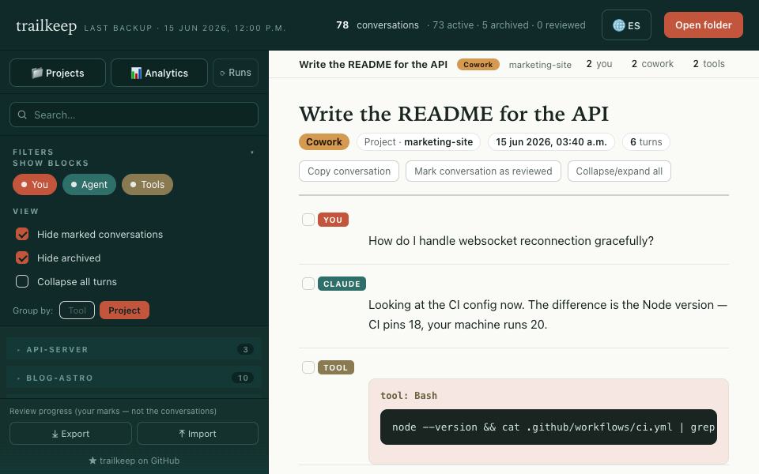
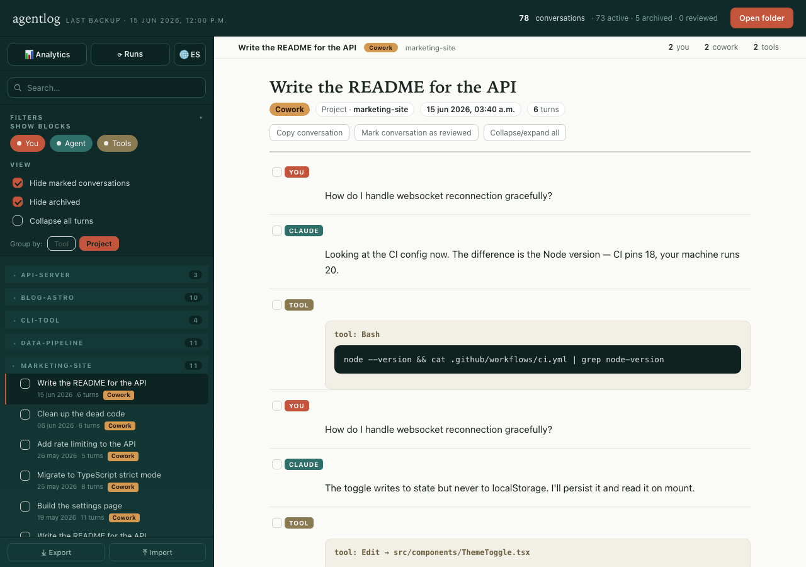
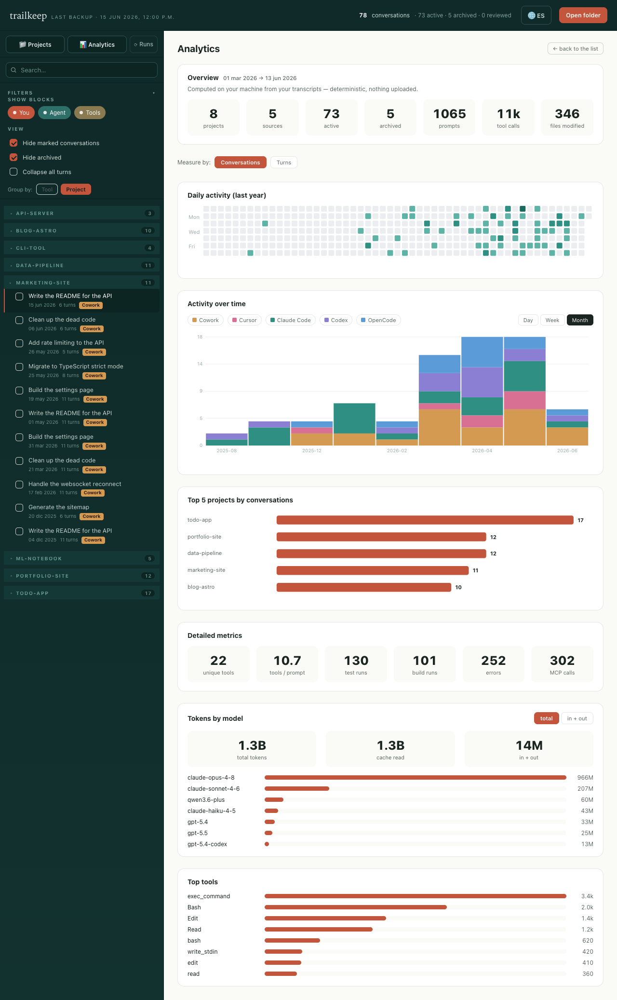
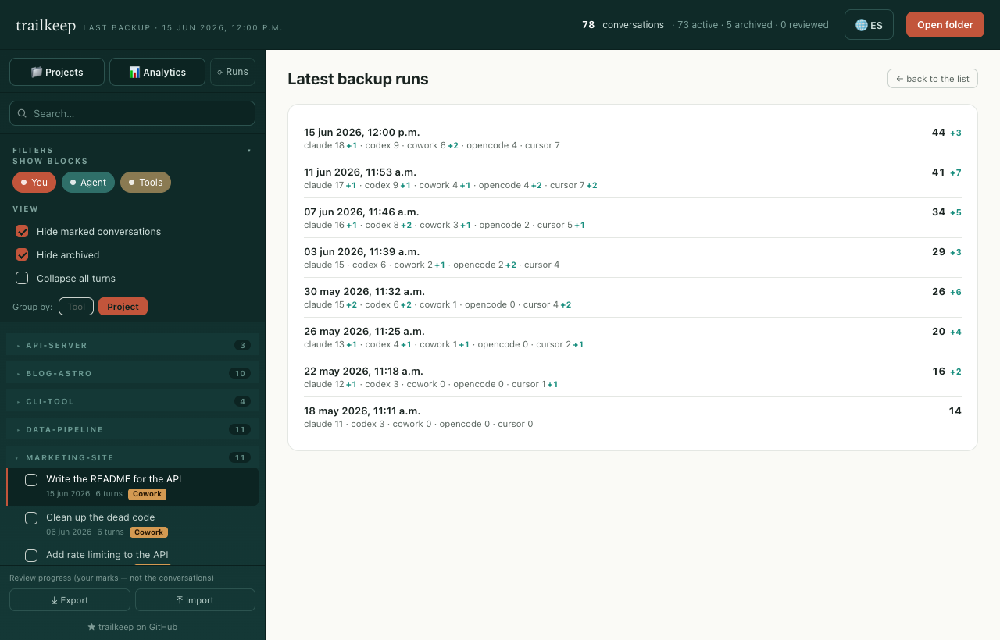

# agentlog

**🇬🇧 English · 🇪🇸 [Español](README.es.md)**

Local backup + viewer for your conversations with AI-coding tools.

This project reads where each tool stores its sessions on your disk, converts
them into readable Markdown with standard metadata, and gives you a standalone
HTML viewer to browse, group, filter and see analytics of your usage.

Everything runs **locally on your Mac**. Nothing is uploaded anywhere. The viewer
UI is **bilingual (English / Spanish)** with a language toggle.

**▶ [Try the live demo](https://lucasgday.github.io/agentlog/)** — the viewer with
sample data, to see how it works. It runs entirely in your browser and **uploads
nothing**; to back up and browse *your own* conversations, install it (below) and
use the local `viewer.html`.



---

## Why

**By default, your AI tools don't keep your history forever — and you rarely
notice when you lose it.**

- **Claude Code** cleans up old transcripts after a while (by default, based on
  last activity). It's **configurable**: raising `cleanupPeriodDays` in
  `~/.claude/settings.json` extends retention a lot, or effectively disables it.
  But if you never touched it, you're on the default and old sessions disappear.
- **Codex** only lists recent conversations; older ones stop showing up even if
  they linger on disk for a while.
- Each tool has its own policy, format and scope. And if you reinstall, switch
  machines, run an `rm` or a database gets corrupted, that history is gone
  **without warning** and without a trash bin.

> **Honest note:** if you use *only* Claude Code and raise `cleanupPeriodDays`,
> much of the automatic deletion stops being a problem. Even so, this still gives
> you what a retention setting doesn't (see below).

What this project gives you, beyond each tool's retention:

- **A durable, separate copy.** Cumulative: once backed up, a conversation is
  **never deleted from your copy**, even if the source tool removes it, you
  reinstall, or you migrate machines.
- **A single multi-tool archive.** Claude Code, Codex, Cowork, OpenCode and
  Cursor together in one place and format, not five silos with their own rules.
- **Something actually browsable.** Readable Markdown + a viewer with search,
  grouping, filters, analytics and review-marking — not raw `.jsonl`/SQLite.

Those conversations often hold **design decisions, the why behind how something
was done, and context your code doesn't record**. The point is to keep it safe
and at hand.

And since it's your private data, **everything runs locally**: the scripts only
read your files and write Markdown to your disk, the viewer is a static HTML
file. No server, no cloud, no telemetry. (See [Privacy](#privacy).)

---

## How it compares

agentlog grew out of the same idea as YC's **Paxel** — making sense of your
Claude Code / Codex / Cursor sessions — but with the opposite default on your
data. Paxel runs its analysis locally yet **uploads derived data** to YC (prompt
excerpts, file paths, commit metadata, narratives) to build an online profile; a
community security audit found it sending more than advertised, and the launch
promo was pulled amid the privacy backlash ([audit](https://www.gate.com/news/detail/y-combinators-paxel-ai-tool-claims-local-analysis-but-security-audit-21668126),
[coverage](https://digg.com/ai/urogjb9u)).

agentlog is **self-hosted and offline** — it only reads your local files and
writes local Markdown. Nothing, raw or derived, leaves your machine.

| | agentlog | Paxel |
|---|---|---|
| Data leaving your machine | **None** | Derived data uploaded to YC |
| Hosting | Self-hosted / offline | Cloud (YC) |
| Output | Durable Markdown archive + browsable viewer | One-shot online "builder profile" |
| Open source | Yes (MIT) | No |

---

## What it does

- **Incremental, cumulative backup.** Only processes what's new or changed since
  the last run. Never deletes already-generated markdowns, even if the source
  tool removes the original conversation.
- **Markdown conversion.** Each session becomes a `.md` with title, date, id,
  project and source, and separated turns (`### You` / `### Claude`, etc.).
- **Standalone HTML viewer** (`viewer.html`). Opens with a double-click
  (`file://`), no server. Groups by source or project, colors by tool, filters
  archived and reviewed, copies per turn or whole conversation, marks
  conversations as reviewed (progress exportable/importable as JSON), shows the
  run history and an **analytics** view (GitHub-style daily heatmap, top
  projects, activity over time by day/week/month, toggling conversations/turns).
  Bilingual UI (EN/ES).
- **Daily automatic backup** via `launchd` (optional).

---

## Supported sources

| Tool         | Location on disk                                                       |
|--------------|------------------------------------------------------------------------|
| Claude Code  | `~/.claude/projects/*/*.jsonl`                                          |
| Codex        | `~/.codex/sessions` and `~/.codex/archived_sessions`                    |
| Cowork       | `~/Library/Application Support/Claude/local-agent-mode-sessions`        |
| OpenCode     | `~/.local/share/opencode/opencode.db`                                   |
| Cursor       | `~/Library/Application Support/Cursor/User/globalStorage/state.vscdb`   |

### Not supported (and why)

- **Antigravity** — stores sessions in a proprietary protobuf format with no
  public schema, so there's no stable way to parse them.
- **claude.ai** (the web app) — conversations live in Anthropic's cloud, not on
  your disk, so there's nothing local to back up.

---

## Install

Requires **macOS** and **Python 3** (ships with macOS).

```bash
# Make the scripts executable
chmod +x update-backup.sh *.command
```

### Run the backup by hand

```bash
./update-backup.sh
```

By default the base is the folder where the script lives. You can pass another
path as the first argument to store the markdowns elsewhere:

```bash
./update-backup.sh ~/my-backups
```

**Options** (run `./update-backup.sh --help` for the full list):

```bash
./update-backup.sh --only claude,codex   # only some sources
./update-backup.sh --dry-run             # preview what would change, write nothing
```

You can also **double-click** `update-backup.command`.

### Enable the automatic backup (daily, 12:00)

Double-click `install-auto.command`. It installs a `launchd` task that runs the
backup every day at noon (or when the Mac wakes up if it was asleep).

To remove it: double-click `uninstall-auto.command`.

---

## Using the viewer

Open **`viewer.html`** with a double-click (it opens in your browser as
`file://`) and point it at the folder with your `markdown-*` backups (the same
base folder). From there you can browse, filter, copy and see the analytics.

By default it groups by **project**, hides archived and already-reviewed
conversations, and opens the most recent active conversation. You can change the
grouping (by tool), the filters and the **language (EN/ES)** from the top bar /
sidebar.

---

## Screenshots

> Generated from **sample data**, not real conversations.

**Conversation list** — grouped by project by default, with turns and tool
blocks rendered.



**Analytics** — summary, daily heatmap of the last year, top projects and
activity over time (day/week/month, conversations or turns).



**Run history** — every backup is logged, with how many new conversations each
source contributed.



---

## Privacy

- **Nothing leaves your machine.** The scripts only read local files and write
  local Markdown; the viewer is a static HTML file you open with `file://`. No
  network calls, no server, no telemetry.
- **The repo includes NO conversations.** The `.gitignore` excludes all markdown
  folders, the raw data (`*.jsonl`, `*.db`, `*.vscdb`, `*.pb`) and the sync
  state. Everyone backs up **their own** conversations locally; real content is
  never committed.
- **Even the hosted demo uploads nothing.** GitHub Pages only serves static HTML;
  any folder you open is read in your browser via the File API and never sent
  anywhere — the viewer makes zero network calls. That said, a hosted page is
  fetched fresh each visit, so for real, everyday use prefer the local
  `viewer.html` (`file://`): it's fixed and fully inspectable.

---

## Contributing

**Suggestions and contributions are welcome** — especially to **support more
AI-coding tools**. If the one you use stores its sessions on disk and isn't on
the list, open an *issue* or send a *pull request*.

Adding a new source is small: you just need a converter that reads that origin
and writes the same standard Markdown the others do —

```
# <title>

<!-- date: <ISO> | id: <id> | project: <project> | source: <source> | archived: <true|false> -->

### You

…

### <Assistant>

…
```

Once the converter produces that format, the viewer and the rest of the flow
pick it up without changes. Look at any of the `convert_*.py` files as a
reference. Bug reports, viewer improvements and ideas in general are welcome too.

---

## Notes

- **macOS-only for now.** It uses `launchd` and macOS-specific paths to locate
  the sources. Porting to Linux/Windows would mean adjusting those paths and the
  automatic-task mechanism.

---

## License

MIT — see [LICENSE](LICENSE).
