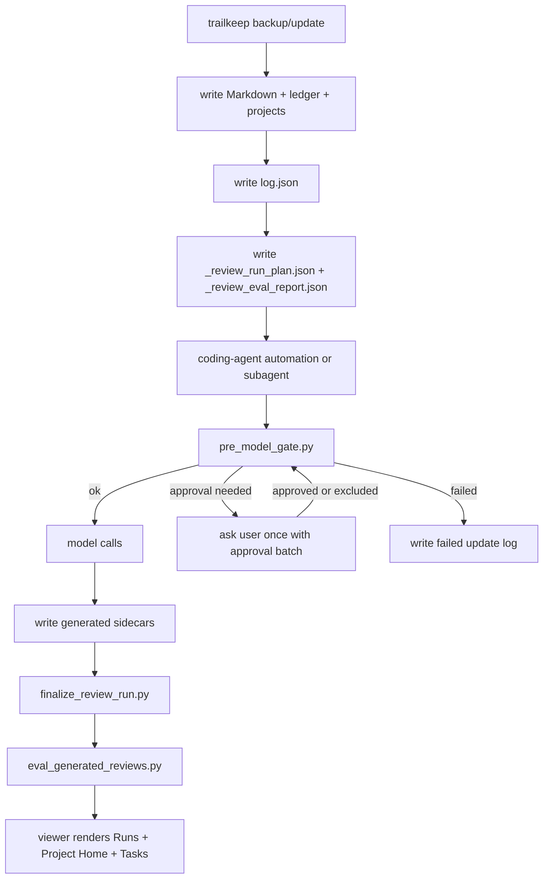

# Generative Layer Spec

trailkeep's backup scripts and viewer are local, deterministic, and zero-network.
The generative layer is optional: it runs in the user's own coding agent after the
local backup finishes, then writes local sidecars that the viewer can read.

## Current Status

Implemented in trailkeep:

- `update-backup.sh` writes Markdown backups, `_ledger.json`, `_projects.json`,
  `_review_run_plan.json`, and `_review_eval_report.json`.
- `converters/eval_generated_reviews.py` validates generated review sidecars and
  writes `_review_generated_eval_report.json`.
- `skills/trailkeep-project-review/` contains the repo-versioned skill and its
  deterministic finalizer script.
- The viewer reads optional `_conversation_summaries.json`,
  `_project_reviews.json`, `_agent_profile.json`, and `_review_update_log.json`.
- The setup/manual prompt text is canonized in `docs/prompts.md`; the viewer
  embeds offline copies that point the user's coding agent to this spec.

Not implemented yet:

- the recurring post-backup automation in the user's coding agent;
- model calls;
- generation of the optional sidecars;
- generated-output quality evals beyond the deterministic local checks.

## Activation Model

The generative layer must be opt-in.

Recommended flow:

1. The user runs the normal trailkeep backup.
2. The viewer offers a short setup prompt.
3. The user pastes that prompt into their coding agent.
4. The coding agent reads this spec from the local trailkeep repo.
5. The coding agent installs or links the shared skill into its local skill
   location, if that agent supports skills.
6. The coding agent creates its own recurring automation that runs after the
   trailkeep daily backup.
7. The automation reads `_review_run_plan.json`, respects
   `_review_eval_report.json`, calls models only when allowed, and writes local
   sidecars.

Do not put model calls inside `update-backup.sh` by default. The backup remains
offline; the coding-agent automation is a separate post-backup job.

## Runtime Flow



Flow rules:

- The backup/update path stays deterministic, offline, and zero-network.
- Planner/eval sidecars are written by trailkeep before the coding-agent
  automation starts.
- The automation should run in a dedicated coding-agent automation thread or
  subagent. The main user-visible thread is only for setup, batch approvals, and
  failures that need intervention.
- `pre_model_gate.py` must pass before any model call. It rejects stale backup
  logs, stale/mismatched plan/eval files, failed planner evals, and unresolved
  approval flags.
- Approval is batched once per gate run, using sanitized project names and input
  ids. Never print suspected secret values.
- The viewer only reads local sidecars. It does not call models, notify external
  systems, or make network requests.

## Architecture Decisions

These are the current product/runtime decisions for the optional generative
layer:

- **One skill, multiple modes.** Use one shared `trailkeep-project-review` skill
  with modes/tier intent. Do not create one skill per model or one skill per
  review type.
- **The automation routes models.** The skill defines workflow, gates, schemas,
  sidecar contracts, and tier intent. The user's coding-agent automation maps
  `cheap`, `default`, and `strong` to whatever concrete models are available in
  that user's environment. If per-task routing is unavailable but the automation
  can choose one model, configure that automation to use the `strong` tier by
  default. If the agent cannot choose a model at all, use the available model and
  write `model_routing: "unavailable"`.
- **No model calls in the backup.** `update-backup.sh` stays deterministic and
  offline. It writes Markdown, ledger, project metadata, preflight plan, and
  deterministic planner evals.
- **Generative runs happen after backup/update.** The optional automation runs
  only after the daily trailkeep backup/update finishes, or through the manual
  per-project refresh prompt.
- **Time-based fallback is allowed.** Prefer a real post-backup trigger when the
  user's coding agent supports it. If only a scheduled job is available, infer
  the daily backup/update time from the installed launchd/cron job or recent
  `log.json` entries and schedule the generative review 10-15 minutes later.
  Before any model call, the gate must confirm the plan/eval are current and
  aligned, and that the latest `log.json` backup run is less than 24 hours old.
- **The preflight plan selects context.** `_review_run_plan.json` is the input
  manifest. The automation must not upload or transmit the full backup folder
  blindly.
- **Repo docs outrank conversations.** Roadmap/backlog/todo/design/agent docs in
  the project repo are source of truth. Conversation summaries provide recent
  evidence and unresolved context.
- **Outputs stay in the backup folder.** Generated sidecars are written only at
  `backup_dir` root, never into project repos, source-tool raw folders,
  `markdown-*` folders, or the trailkeep repo.
- **Approval gates are executable.** The skill's `pre_model_gate.py` blocks model
  calls when planner evals fail or when `requires_approval` /
  `possible_secret` requires user approval.
- **Generated-output evals are executable.** The skill's finalizer runs
  `eval_generated_reviews.py`, writes `_review_generated_eval_report.json`,
  appends `_review_update_log.json`, and exits nonzero unless the run can be
  treated as `ok`.
- **No global daily token cap by default.** Token estimates exist for visibility,
  approval, and routing, not to stop the whole daily run by volume.
- **Opt-in remote-provider risk.** If the coding agent uses a remote LLM
  provider, selected project context may be sent to that provider. Recurring
  automation that sends context remotely requires user approval.
- **Remote-provider approval is setup-time, not daily.** Once the user approves
  recurring automation with a remote or unproven-local model provider, daily
  runs should not ask again merely because the provider is remote. Per-run
  approval is required only when `_review_run_plan.json` sets
  `requires_approval` / `possible_secret`, or when the recurring automation's
  provider, model, scope, schedule, or output files materially change.

## Output Location

Resolve `backup_dir` as the trailkeep backup folder that contains both:

- `markdown-*` folders;
- the `_review_run_plan.json` being consumed.

Write all generated sidecars at the root of that `backup_dir`:

- `<backup_dir>/_conversation_summaries.json`
- `<backup_dir>/_project_reviews.json`
- `<backup_dir>/_agent_profile.json`
- `<backup_dir>/_review_update_log.json`
- optional drafts: `<backup_dir>/AGENTS.generated.md` and
  `<backup_dir>/CLAUDE.generated.md`

Runtime gate sidecars may also be written at `backup_dir` root:

- `<backup_dir>/_review_gate_decisions.json`
- `<backup_dir>/_review_effective_plan.json`

Do not write generated sidecars inside project repos, source-tool raw folders,
`markdown-*` folders, or the trailkeep repo. If multiple backup folders are
present, use the one containing the plan being consumed. If ambiguous, ask the
user.

Generated sidecars are private user data and must not be committed.

## Privacy

- trailkeep itself stays local and never makes network calls. The backup scripts
  and viewer never send data.
- This optional review layer is agent-powered and runs inside the user's coding
  agent. If that agent uses a remote model provider, selected project context may
  be sent to that provider as part of the review.
- If the agent cannot prove the model is local/on-device, treat it as remote.
- Only send context selected by `_review_run_plan.json` unless the user approves
  a wider deep-review scope.
- Default daily runs should be incremental: use previous sidecars, repo
  planning/design docs, and only new or changed conversations.
- Full raw conversation reads are allowed only for explicit bootstrap or
  deep-review modes, scoped to the project being reviewed unless the user
  approves a global full-archive pass.
- Do not send secrets, API keys, tokens, credentials, private `.env` files, or
  unrelated repo data.
- Never transmit the entire backup folder as an archive or unscoped dump. Build
  an input manifest first: project, files/session ids selected, reason,
  estimated tokens, and model tier.
- Before installing or enabling any recurring job that may call a remote model,
  show the user the schedule, scope, provider/model tier, concrete model name or
  alias when known, estimated tokens to be processed, local files it will write,
  and the fact that selected context may be sent to the provider. Wait for
  approval once during setup.
- After that setup approval, do not ask on every daily run merely because the
  model provider is remote. Ask again only for per-run safety flags
  (`requires_approval` / `possible_secret`) or material automation/provider
  changes.
- Never print suspected secret values in approval prompts, logs, sidecars, or
  eval reports.

## Source Precedence

For project next steps, roadmap status, tasks, and open questions, repo planning
docs are the source of truth. Prefer, in order:

- `ROADMAP.md`
- `BACKLOG.md`
- `TODO.md`
- `docs/product-progress.md`
- `docs/project-progress.md`
- `docs/agent-handoff.md`
- `docs/design-patterns.md`
- `docs/design.md`
- `design.md`
- `AGENTS.md` when it contains continuity, product, roadmap, or project-specific
  operating instructions
- local issues/backlog/config files when the repo uses them as planning sources
- close equivalents found in the repo

For next steps, roadmap status and tasks, roadmap/backlog/product-progress files
win over conversations. For design-system extraction, prefer `design.md`,
`docs/design.md`, `docs/design-patterns.md`, and real component/source files.
Conversations only explain recent decisions, changes, or undocumented context.
Preserve the user's existing priority/order from roadmap and backlog files.
Suggested next steps should advance the existing roadmap when one is present.
If conversations reveal new legitimate work that is not in the roadmap, add it
as a pending/candidate task or open question with evidence. Do not silently
promote it above the roadmap's existing priorities.

Design-system review runs daily, but incrementally:

- Skip projects without UI/design changes.
- Use existing design docs (`design.md`, `docs/design.md`,
  `docs/design-patterns.md`) and component files as source of truth.
- Use new conversations only as evidence for changes or undocumented decisions.
- Update the project design-system summary only with new evidence.
- If changes are broad or conflicting, set `needs_deep_design_review: true`
  instead of rereading the full project automatically.

Use trailkeep conversations as supporting evidence for recent decisions,
completed work, blockers, and undocumented context. If conversations contradict
repo docs, keep the repo doc as the source of truth and create an
`open_question`; do not silently override the repo doc.

## Sidecar Layers

### Conversation Summary

`_conversation_summaries.json` summarizes one conversation at a time, keyed by
conversation/session id. This is the base incremental layer: daily project
reviews should consume these summaries instead of rereading every raw
conversation.

```json
{
  "version": 1,
  "updated_at": "ISO timestamp",
  "conversations": {
    "session-id": {
      "project": "",
      "source": "",
      "date": "",
      "content_hash": "",
      "summary": "",
      "decisions": [],
      "blockers": [],
      "task_hints": [],
      "files_or_areas": [],
      "reviewed_at": ""
    }
  }
}
```

### Project Summary / Project Review

`_project_reviews.json` combines repo docs, deterministic metadata,
conversation summaries, and changed conversations. It is the strong project
summary layer: repo planning/design docs are source of truth, and conversation
summaries are recent evidence.

```json
{
  "version": 1,
  "updated_at": "ISO timestamp",
  "projects": {
    "project-name": {
      "summary": "",
      "standing_context": "",
      "next_step": "",
      "roadmap_status": "",
      "open_questions": [],
      "tasks": [],
      "suggested_next_prompt": "",
      "design_system": {
        "summary": "",
        "components": [],
        "rules": [],
        "needs_deep_design_review": false
      },
      "checkpoints": {
        "last_reviewed_at": "",
        "last_reviewed_backup_run": "",
        "last_reviewed_activity": "",
        "last_reviewed_git_commit": "",
        "reviewed_sessions": {},
        "reviewed_repo_docs": {},
        "reviewed_project_metadata": {}
      }
    }
  }
}
```

Tasks must have stable ids. Do not change a task id unless evidence closes,
splits, merges, or materially changes that task.

### Global Agent Profile

`_agent_profile.json` captures recurring preferences, working style, repo
conventions, and prompt patterns across projects. It may also draft global or
per-repo `AGENTS.md` / `CLAUDE.md` suggestions from repeated patterns across
conversations and projects.

```json
{
  "version": 1,
  "updated_at": "ISO timestamp",
  "scope": "global",
  "recurring_preferences": [],
  "working_style": [],
  "repo_conventions": [],
  "prompting_patterns": [],
  "suggested_global_agents_md": "",
  "suggested_global_claude_md": "",
  "evidence": []
}
```

Draft `AGENTS.generated.md` or `CLAUDE.generated.md` files may be written in
`backup_dir` for review. Do not write them directly into project repos unless
the user explicitly asks.

### Update Log

`_review_update_log.json` records what the optional automation did. Keep one
global chronological log in the backup root; do not create per-project log files
unless a real size or performance problem appears.

```json
{
  "version": 1,
  "updated_at": "ISO timestamp",
  "runs": [
    {
      "date": "ISO timestamp",
      "status": "ok | needs_approval | failed",
      "projects": ["project-name"],
      "conversation_summaries": 0,
      "tasks_added": 0,
      "tasks_closed": 0,
      "requires_approval": false,
      "possible_secret": false,
      "model_provider": "",
      "model_used": "",
      "model_routing": "available | unavailable",
      "outputs": [
        "_conversation_summaries.json",
        "_project_reviews.json",
        "_agent_profile.json"
      ],
      "errors": []
    }
  ]
}
```

The viewer renders this in Runs and filters the same global log in affected
Project Homes.

## Checkpoints

Checkpoints live inside each `_project_reviews.json` project entry and drive
incrementality.

Recommended shape:

```json
{
  "checkpoints": {
    "last_reviewed_at": "2026-06-22T10:30:00-03:00",
    "last_reviewed_backup_run": "2026-06-22T10:20:00-03:00",
    "last_reviewed_activity": "2026-06-21T18:12:00-03:00",
    "last_reviewed_git_commit": "abc1234",
    "reviewed_sessions": {
      "session-id-1": {
        "content_hash": "sha256...",
        "date": "2026-06-21T18:12:00-03:00",
        "source": "claude-code",
        "title": "Fix dashboard cards"
      }
    },
    "reviewed_repo_docs": {
      "ROADMAP.md": {
        "content_hash": "sha256...",
        "reviewed_at": "2026-06-22T10:30:00-03:00"
      },
      "docs/design.md": {
        "content_hash": "sha256...",
        "reviewed_at": "2026-06-22T10:30:00-03:00"
      }
    },
    "reviewed_project_metadata": {
      "metadata_hash": "sha256...",
      "git_commit": "abc1234",
      "deploy_url": "https://example.com",
      "stack_hash": "sha256..."
    }
  }
}
```

Rules:

- `reviewed_sessions` is keyed by session id when the Markdown metadata provides
  one; otherwise use the Markdown relative path.
- `content_hash` is the hash from `_review_run_plan.json` for that selected
  input.
- `reviewed_repo_docs` uses paths relative to the project repo.
- If an input hash changes, select it again.
- If an input disappears, do not silently delete the checkpoint. Mark it stale
  only with evidence.
- `last_reviewed_git_commit` is a hint, not the only source of truth; uncommitted
  work can still matter.
- Update checkpoints only after the generated sidecars validate.

## Cumulative Review Model

Cumulative means the review layer preserves compact memory and processes deltas
instead of rereading the whole archive every day:

- Do not reread every conversation on every run.
- Store fingerprints/checkpoints per project in `_project_reviews.json`.
- Send the model only selected deltas by default: new or changed conversations,
  new or changed repo planning/design docs, changed deterministic metadata, and
  prior compact sidecars needed as memory.
- Reuse previous conversation summaries, project reviews, and agent profile
  entries as compact memory.
- Preserve stable task ids and review notes unless new evidence justifies a
  change.
- Mark stale items only with evidence; do not silently delete old checkpoints.
- Time passing alone is not evidence of staleness. Never reread the full project
  just because a daily run happened or a checkpoint is old.
- Run a broader/deep review only for bootstrap, explicit manual deep-review
  requests, deterministic broad/conflicting changes, low confidence,
  evidence-backed stale checkpoints, or major metadata changes such as stack,
  repo URL, deploy URL, or git commit drift.

Per project, the automation should:

1. Compare current sessions, repo docs, metadata, git state, and deploy state
   against `_project_reviews.json` checkpoints.
2. If nothing changed, skip the project.
3. If only small new conversations changed, send the previous compact project
   review plus the new/changed conversation summaries or conversations only.
4. If repo docs, metadata, git state, design docs, or conversation evidence
   changed heavily or conflict, or if the delta is insufficient to update with
   confidence, run a broader review or set the matching deep review flag.
5. Preserve existing task ids unless evidence says to update, close, split, or
   replace them.

## Planner Contract

`_review_run_plan.json` is generated by trailkeep during the local backup run.
It must include selected projects, selected repo docs, selected conversation ids,
selected summaries/sidecars, reasons, character counts, word counts, estimated
input tokens, expected output tokens, intended model tier, remote-provider risk,
approval flags, and local output files.

Token estimates are deterministic. If no tokenizer is available, trailkeep uses
the conservative fallback `ceil(characters / 4)`. There is no global daily token
cap by default; estimates are for visibility and routing.

## Flag Handling

The planner marks flags. The coding-agent automation interprets them.

- `requires_approval: true`: stop before model calls and ask the user.
- `possible_secret: true`: show which input is marked, do not print the secret,
  then ask whether to exclude the input, approve it, or stop.
- `needs_deep_review: true`: use the deep project review mode and stronger model
  tier if available.
- `needs_deep_design_review: true`: run design-system extraction.
- both deep flags false: run the cheap/default incremental update over summaries
  and deltas.

Batch all approval cases from one gate run into a single user intervention. Do
not ask project-by-project.

Suggested conversational approval prompt:

```text
Trailkeep review paused.

The gate found inputs that need approval before any model call.

Flagged inputs:
- Project: <project>
  Reason: possible_secret or requires_approval
  Input: <type> <id_or_path>

No secret content is shown. Review the full batch once.

Choose:
1. Exclude selected input ids and continue.
2. Approve sending selected input ids to the configured LLM provider.
3. Stop this run.
```

When paused, append `_review_update_log.json` with `status: "needs_approval"`.
The automation must surface this as a user-visible intervention in the coding
agent, preferably by opening or resuming the automation's coding-agent thread
and posting the sanitized approval batch there. If the agent cannot create or
resume a thread, use its closest supported user-intervention surface. Do not
continue model calls until the user explicitly chooses an option.

`needs_approval` is a transient pause, not a permanent blocker. To resolve it,
the automation writes `_review_gate_decisions.json` with the user's approved or
excluded inputs, scoped to the current `_review_run_plan.json` `generated_at`
and each input's id/path plus `content_hash`. Do not edit `_review_run_plan.json`
directly. Rerun `pre_model_gate.py` after writing decisions. If every flagged
input is approved or excluded, the gate exits `0`, writes
`_review_effective_plan.json`, and model calls may proceed using that effective
plan. Excluded inputs must not be sent to the model. Older `needs_approval` log
entries remain historical and are superseded by the later resolved run.

## Model Tier Intent

Use one shared skill with multiple modes. Do not create one skill per model.

Recommended tier intent:

```json
{
  "conversation_summary": "cheap",
  "project_review_incremental": "default",
  "deep_project_review": "strong",
  "design_system_extraction": "strong",
  "global_agent_profile": "strong",
  "generative_eval": "default"
}
```

If the coding agent can route models per task, map `cheap`, `default`, and
`strong` to concrete models in that user's environment. If per-task routing is
unavailable but the automation can choose one model, configure that automation
to use the `strong` tier by default. If the agent cannot choose a model at all,
keep `model_tier` metadata and write `model_routing: "unavailable"` in
`_review_update_log.json`.

Every generated review run should also record the concrete model that actually
handled the run in `_review_update_log.json` as `model_used` when the agent can
observe it. If the exact model is hidden by the agent/provider, write the closest
available label, such as the configured model alias or `"unknown"`.

## Daily Automation Sequence

Recommended daily sequence:

1. Run trailkeep's normal backup/update.
2. Read `<backup_dir>/_review_run_plan.json`.
3. Read `<backup_dir>/_review_eval_report.json`.
4. Run
   `python3 <skill_dir>/scripts/pre_model_gate.py --backup-dir <backup_dir>`.
5. If the gate exits nonzero, stop before model calls. Exit code `1` is a failed
   deterministic planner/preflight state, including stale or mismatched
   plan/eval files or a stale/missing `<backup_dir>/log.json` latest backup run;
   exit code `2` requires user approval.
   For exit code `2`, open or resume the coding-agent thread and post one
   sanitized approval batch from the gate output.
6. Summarize new or changed conversations.
7. Update changed project reviews.
8. Run the daily incremental design-system pulse only for changed design
   evidence; skip projects without UI/design changes.
9. Update global agent profile from compact project reviews.
10. Run
   `python3 <skill_dir>/scripts/finalize_review_run.py --trailkeep-repo <trailkeep_repo> --backup-dir <backup_dir>`.
11. Confirm `_review_update_log.json` and `_review_generated_eval_report.json`
    reflect the final status.

If generated-output evals fail, do not mark the run `ok`. Append a failed
update-log entry or update the current entry with `status: "failed"` and the
eval failure names.

## Generated Output Evals

The generated-output eval runner lives in the trailkeep repo, not only in the
prompt:

`converters/eval_generated_reviews.py`

The skill finalizer wraps that runner:

`skills/trailkeep-project-review/scripts/finalize_review_run.py`

Do not duplicate generated-output checks inside the skill prompt or automation
instructions. The executable checks live in
`converters/eval_generated_reviews.py`; the finalizer invokes that runner,
records `_review_generated_eval_report.json`, appends `_review_update_log.json`,
and exits nonzero when the run should not be considered successful.

Inputs:

- `<backup_dir>/_conversation_summaries.json`
- `<backup_dir>/_project_reviews.json`
- `<backup_dir>/_agent_profile.json`
- `<backup_dir>/_review_run_plan.json`
- optional `<backup_dir>/_review_update_log.json`
- Markdown backups for session ids and hashes
- `_projects.json` for project names

Output:

- `<backup_dir>/_review_generated_eval_report.json`

Minimum checks:

- `schema`: JSON is valid and required fields exist.
- `incrementality`: if one conversation in one project changes, only that
  project's generated entries should need to change.
- `referential_integrity`: project names and session ids exist.
- `checkpoint_integrity`: reviewed session/doc hashes match selected inputs.
- `task_stability`: task ids remain stable unless evidence justifies a change.
- `privacy`: generated output does not include secret-looking literals, tokens,
  private emails, or `.env` values; fixtures with fake secrets must never appear
  in output.
- `source_precedence`: if `ROADMAP.md` or equivalent repo docs contradict a
  conversation, repo docs win and an `open_question` is created.
- `no_full_dump`: every run has an input manifest with selected files/session
  ids and reasons; no whole backup-folder archive or unscoped dump is used.
- `token_estimate`: planned estimates are compared with processed input size or
  actual token metadata when available.
- `actionability`: `next_step` and `suggested_next_prompt` are specific and
  executable.
- `update_log`: a run with failures is not marked `ok`.

The automation must run these evals after writing sidecars. If they fail, do not
mark the run `ok`. Prefer the skill finalizer because it also writes
`_review_update_log.json` and reruns evals so the log itself is validated.

## Skill Packaging

The shared skill should be versioned in the repo, for example:

```text
skills/trailkeep-project-review/SKILL.md
skills/trailkeep-project-review/scripts/
skills/trailkeep-project-review/fixtures/
```

The user's coding agent may need a copy or symlink in its local skill directory,
such as `~/.codex/skills/trailkeep-project-review` or that agent's equivalent.
The repo copy is the source of truth; the local agent copy is the installed
runtime artifact.

The bundled finalizer is the required deterministic post-write step:

```sh
python3 <skill_dir>/scripts/finalize_review_run.py --trailkeep-repo <trailkeep_repo> --backup-dir <backup_dir>
```

The bundled pre-model gate is the required deterministic pre-call step:

```sh
python3 <skill_dir>/scripts/pre_model_gate.py --backup-dir <backup_dir>
```

## Manual Project Refresh

The viewer's "Update this project now" prompt is a manual fallback. Use it only
to refresh one project immediately, without waiting for the daily automation.
It should still write outputs to `backup_dir`, preserve checkpoints, and follow
this spec.

## Product Boundary

This design is optimized for a solo developer reviewing their own local coding
history. Team workflows, shared approvals, shared provider policies, and
multi-user notification surfaces are out of scope until there is explicit product
need.
