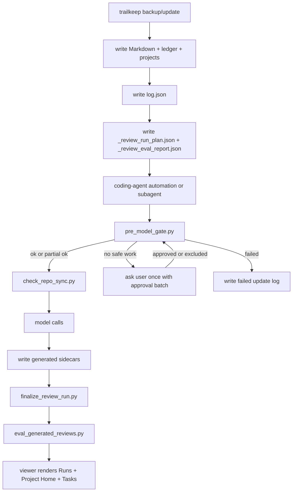

# Generative Layer Spec

trailkeep's backup scripts and viewer are local, deterministic, and zero-network.
The generative layer is optional: it runs in the user's own coding agent after the
local backup finishes, then writes local sidecars that the viewer can read.

## Current Status

Implemented in trailkeep:

- `update-backup.sh` writes Markdown backups, `_ledger.json`, `_projects.json`,
  `_review_run_plan.json`, and `_review_eval_report.json`.
- `converters/eval_generated_reviews.py` validates generated review sidecars and
  writes `_review_generated_eval_report.json`.
- Generated conversation summaries require
  `summary_quality_version: "actionable-v2"` and deterministic quality checks
  reject bootstrap boilerplate, role-marker pollution, stale versions, and
  low-signal conversations that invent tasks.
- Per-summary deterministic validation is available through the wrapper command
  `scripts/run-project-review-agent-gates.sh validate-summary`.
- Project-scoped review testing is available through
  `scripts/run-project-review-agent-gates.sh prepare-test`, which creates an
  isolated sandbox for one project before model calls.
- `skills/trailkeep-project-review/` contains the repo-versioned skill and its
  deterministic finalizer script.
- `skills/trailkeep-project-review/scripts/check_repo_sync.py` checks local git
  repos for remote freshness during the optional agent run and writes
  `_review_repo_sync.json`.
- The viewer reads optional `_conversation_summaries.json`,
  `_project_reviews.json`, `_agent_profile.json`, and `_review_update_log.json`.
- The setup/manual prompt text is canonized in `docs/prompts.md`; the viewer
  embeds offline copies that point the user's coding agent to this spec.

Not implemented yet:

- the recurring post-backup automation in the user's coding agent;
- model calls;
- generation of the optional sidecars;
- viewer rendering of semantic quality sampling details beyond the Runs log.

## Activation Model

The generative layer must be opt-in.

Recommended flow:

1. The user runs the normal trailkeep backup.
2. The viewer offers a short setup prompt.
3. The user pastes that prompt into their coding agent.
4. The coding agent reads this spec from the local trailkeep repo.
5. The coding agent installs or links the shared skill into its local skill
   location, if that agent supports skills.
6. The coding agent creates its own recurring automation that runs after the
   trailkeep daily backup.
7. The automation reads `_review_run_plan.json`, respects
   `_review_eval_report.json`, calls models only when allowed, and writes local
   sidecars.

Do not put model calls inside `update-backup.sh` by default. The backup remains
offline; the coding-agent automation is a separate post-backup job.

## Runtime Flow



Flow rules:

- The backup/update path stays deterministic, offline, and zero-network.
- Planner/eval sidecars are written by trailkeep before the coding-agent
  automation starts.
- The automation should run in a dedicated coding-agent automation thread or
  subagent. The main user-visible thread is only for setup, batch approvals, and
  failures that need intervention.
- The automation should call
  `<trailkeep_repo>/scripts/run-project-review-agent-gates.sh` for all required
  gates. Direct Python scripts are implementation details behind this wrapper.
- `pre_model_gate.py` must pass before any model call. It rejects stale backup
  logs, stale/mismatched plan/eval files and failed planner evals. With
  unresolved approval flags, it either writes a partial safe
  `_review_effective_plan.json` and exits `0`, or exits `2` when no safe project
  work remains.
- The automation must not reimplement the pre-model gate in prompts, memory, or
  ad hoc logic. `pre_model_gate.py` is the executable source of truth for
  planner eval status, stale plan/eval detection, latest-backup freshness,
  approval batches, partial safe plans, `_review_gate_decisions.json`, and
  `_review_effective_plan.json`.
- `check_repo_sync.py` runs after the gate and before model calls. It may run
  `git fetch` in local project repos to update remote-tracking refs, but never
  `git pull` or working-tree-changing commands.
- Approval is batched once per gate run, using sanitized project names and input
  ids. Never print suspected secret values.
- The viewer only reads local sidecars. It does not call models, notify external
  systems, or make network requests.

## Architecture Decisions

These are the current product/runtime decisions for the optional generative
layer:

- **One skill, multiple modes.** Use one shared `trailkeep-project-review` skill
  with modes/tier intent. Do not create one skill per model or one skill per
  review type.
- **The automation routes models.** The skill defines workflow, gates, schemas,
  sidecar contracts, and tier intent. The user's coding-agent automation maps
  `cheap`, `default`, and `strong` to whatever concrete models are available in
  that user's environment. If per-task routing is unavailable but the automation
  can choose one model, configure that automation to use the `strong` tier by
  default. If the agent cannot choose a model at all, use the available model and
  write `model_routing: "unavailable"`.
- **No model calls in the backup.** `update-backup.sh` stays deterministic and
  offline. It writes Markdown, ledger, project metadata, preflight plan, and
  deterministic planner evals.
- **Generative runs happen after backup/update.** The optional automation runs
  only after the daily trailkeep backup/update finishes, or through the manual
  per-project refresh prompt.
- **Time-based fallback is allowed.** Prefer a real post-backup trigger when the
  user's coding agent supports it. If only a scheduled job is available, infer
  the daily backup/update time from the installed launchd/cron job or recent
  `log.json` entries and schedule the generative review 10-15 minutes later.
  Before any model call, the gate must confirm the plan/eval are current and
  aligned, and that the latest `log.json` backup run is less than 24 hours old.
- **The preflight plan selects context.** `_review_run_plan.json` is the input
  manifest. The automation must not upload or transmit the full backup folder
  blindly.
- **Repo docs outrank conversations.** Roadmap/backlog/todo/design/agent docs in
  the project repo are source of truth. Conversation summaries provide recent
  evidence and unresolved context.
- **Repo freshness is checked by default in the optional agent layer.** There is
  no separate team mode. For any project with a local git repo and upstream, the
  automation should run the repo-sync check before model calls. If nothing is
  remote-ahead, it is just recorded as fresh. If remote commits are ahead of the
  local checkout, mark `repo_may_be_stale` and use `needs_deep_review` or an
  open question. Do not run `git pull` without explicit user approval.
- **Outputs stay in the backup folder.** Generated sidecars are written only at
  `backup_dir` root, never into project repos, source-tool raw folders,
  `markdown-*` folders, or the trailkeep repo.
- **Approval gates are executable.** The skill's `pre_model_gate.py` blocks all
  model calls when planner evals fail. When only some projects need approval,
  it writes `_review_effective_plan.json` with safe projects only, records the
  pending approval batch, and lets model calls proceed for that safe subset.
- **Generated-output evals are executable.** The skill's finalizer runs
  `eval_generated_reviews.py`, writes `_review_generated_eval_report.json`,
  appends `_review_update_log.json`, and exits nonzero unless the run can be
  treated as `ok` or `needs_attention`.
- **No check is only a prompt rule.** The agent should follow the written spec,
  but enforcement comes from the wrapper command:
  `scripts/run-project-review-agent-gates.sh pre` before model calls,
  `scripts/run-project-review-agent-gates.sh repo-sync` before repo-context
  review, and `scripts/run-project-review-agent-gates.sh finalize` after
  sidecars are written.
- **No global daily token cap by default.** Token estimates exist for visibility,
  approval, and routing, not to stop the whole daily run by volume.
- **Opt-in remote-provider risk.** If the coding agent uses a remote LLM
  provider, selected project context may be sent to that provider. Recurring
  automation that sends context remotely requires user approval.
- **Remote-provider approval is setup-time, not daily.** Once the user approves
  recurring automation with a remote or unproven-local model provider, daily
  runs should not ask again merely because the provider is remote. Per-run
  approval is required only when the gate reports unresolved
  `requires_approval`, or when the recurring automation's provider, model,
  scope, schedule, or output files materially change. `possible_secret` inputs
  with `preprocessed_ref` are already redacted locally; missing redaction is
  handled as an automatic exclusion with `needs_attention`, not an approval
  prompt by default.
- **Repo remote-check approval is setup-time, not daily.** Once the user approves
  the recurring automation's non-destructive `git fetch` freshness checks, daily
  runs should not ask again merely because they contact git remotes. Ask again
  only if repo remote-check behavior materially changes or the automation would
  pull/merge/rebase/checkout/commit.

## Output Location

Resolve `backup_dir` as the trailkeep backup folder that contains both:

- `markdown-*` folders;
- the `_review_run_plan.json` being consumed.

Write all generated/runtime sidecars at the root of that `backup_dir`:

- `<backup_dir>/_conversation_summaries.json`
- `<backup_dir>/_project_reviews.json`
- `<backup_dir>/_agent_profile.json`
- `<backup_dir>/_review_update_log.json`
- `<backup_dir>/_review_repo_sync.json`
- optional drafts: `<backup_dir>/AGENTS.generated.md` and
  `<backup_dir>/CLAUDE.generated.md`

Runtime gate sidecars may also be written at `backup_dir` root:

- `<backup_dir>/_review_preprocessed_inputs.json`
- `<backup_dir>/_review_gate_decisions.json`
- `<backup_dir>/_review_effective_plan.json`

Do not write generated sidecars inside project repos, source-tool raw folders,
`markdown-*` folders, or the trailkeep repo. If multiple backup folders are
present, use the one containing the plan being consumed. If ambiguous, ask the
user.

Generated sidecars are private user data and must not be committed.

## Privacy

- trailkeep itself stays local and never makes network calls. The backup scripts
  and viewer never send data.
- This optional review layer is agent-powered and runs inside the user's coding
  agent. If that agent uses a remote model provider, selected project context may
  be sent to that provider as part of the review.
- The optional agent layer may also contact git remotes through `git fetch` to
  check whether local project repos are behind their upstreams. This is not part
  of trailkeep's backup/update path.
- If the agent cannot prove the model is local/on-device, treat it as remote.
- Only send context selected by `_review_run_plan.json` unless the user approves
  a wider deep-review scope.
- Default daily runs should be incremental: use previous sidecars, repo
  planning/design docs, and only new or changed conversations.
- Full raw conversation reads are allowed only for explicit bootstrap or
  deep-review modes, scoped to the project being reviewed unless the user
  approves a global full-archive pass.
- Do not send secrets, API keys, tokens, credentials, private `.env` files, or
  unrelated repo data.
- Never transmit the entire backup folder as an archive or unscoped dump. Build
  an input manifest first: project, files/session ids selected, reason,
  estimated tokens, and model tier.
- Before installing or enabling any recurring job that may call a remote model,
  show the user the schedule, scope, provider/model tier, concrete model name or
  alias when known, estimated tokens to be processed, local files it will write,
  and the fact that selected context may be sent to the provider. Wait for
  approval once during setup.
- After that setup approval, do not ask on every daily run merely because the
  model provider is remote. Ask again only for unresolved `requires_approval`
  flags or material automation/provider changes. `possible_secret` inputs should
  use deterministic redaction first.
- After setup approval for repo freshness checks, do not ask on every daily run
  merely because `git fetch` may contact project remotes. The automation must
  never run `git pull`, merge, rebase, checkout, commit, or otherwise change a
  project worktree without explicit user approval.
- Never print suspected secret values in approval prompts, logs, sidecars, or
  eval reports.

## Source Precedence

For project next steps, roadmap status, tasks, and open questions, repo planning
docs are the source of truth. Prefer, in order:

- `ROADMAP.md`
- `BACKLOG.md`
- `TODO.md`
- `docs/product-progress.md`
- `docs/project-progress.md`
- `docs/agent-handoff.md`
- `docs/design-patterns.md`
- `docs/design.md`
- `design.md`
- `AGENTS.md` when it contains continuity, product, roadmap, or project-specific
  operating instructions
- local issues/backlog/config files when the repo uses them as planning sources
- close equivalents found in the repo

For next steps, roadmap status and tasks, roadmap/backlog/product-progress files
win over conversations. For design-system extraction, prefer `design.md`,
`docs/design.md`, `docs/design-patterns.md`, and real component/source files.
Conversations only explain recent decisions, changes, or undocumented context.
Preserve the user's existing priority/order from roadmap and backlog files.
Suggested next steps should advance the existing roadmap when one is present.
If conversations reveal new legitimate work that is not in the roadmap, add it
as a pending/candidate task or open question with evidence. Do not silently
promote it above the roadmap's existing priorities.
Repo planning docs are source of truth, but generated review may recommend
maintenance patches when they are stale, duplicated, or contradictory. Record
those recommendations in `recommended_repo_doc_updates`; never modify
`ROADMAP.md`, `BACKLOG.md`, `TODO.md`, `docs/design.md`, or equivalent repo docs
automatically during recurring runs.

Design-system review runs daily, but incrementally:

- Skip projects without UI/design changes.
- Use existing design docs (`design.md`, `docs/design.md`,
  `docs/design-patterns.md`) and component files as source of truth.
- Use new conversations only as evidence for changes or undocumented decisions.
- Update the project design-system summary only with new evidence.
- If changes are broad or conflicting, set `needs_deep_design_review: true`
  instead of rereading the full project automatically.

Use trailkeep conversations as supporting evidence for recent decisions,
completed work, blockers, and undocumented context. If conversations contradict
repo docs, keep the repo doc as the source of truth and create an
`open_question`; do not silently override the repo doc.

## Sidecar Layers

### Conversation Summary

`_conversation_summaries.json` summarizes one conversation at a time, keyed by
conversation/session id. This is the base incremental layer: daily project
reviews should consume these summaries instead of rereading every raw
conversation.

```json
{
  "version": 1,
  "updated_at": "ISO timestamp",
  "conversations": {
    "session-id": {
      "project": "",
      "source": "",
      "date": "",
      "content_hash": "",
      "evidence_refs": [
        {
          "type": "conversation",
          "id_or_path": "session-id",
          "content_hash": ""
        },
        {
          "type": "tool",
          "id_or_path": "session-id",
          "tool_name": "Bash | Edit | apply_patch | ...",
          "status": "passed | failed | file changed | command output",
          "content_hash": ""
        }
      ],
      "summary_quality_version": "actionable-v2",
      "signal_level": "administrative | low_signal | context_dependent | decision | implementation | blocker",
      "include_in_project_rollup": true,
      "summary": "",
      "decisions": [],
      "blockers": [],
      "task_hints": [],
      "files_or_areas": [],
      "reviewed_at": ""
    }
  }
}
```

Current summary quality version: `actionable-v2`.

The automation must validate every conversation summary before checkpointing it.
A useful summary is not necessarily long; it is honest about the amount of
signal in the conversation. Each entry must classify `signal_level`:

- `administrative`: coordination, commit/push/status/checking messages, or
  confirmations without durable product or engineering content.
- `low_signal`: little or no durable decision, implementation, blocker, or task.
- `context_dependent`: the message only makes sense with prior context that was
  not selected.
- `decision`: short but contains a durable product or engineering decision.
- `implementation`: records actual work, changed behavior, files, or areas.
- `blocker`: records a real unresolved blocker or approval need.

For `administrative`, `low_signal`, and `context_dependent`, set
`include_in_project_rollup: false` unless there is explicit durable evidence.
Checkpoint the conversation so it is not retried forever, but do not invent
decisions, blockers, or task hints. For short but meaningful conversations,
summarize only the durable decision or task that is actually present.

Before writing a conversation summary, reject:

- `Bootstrap summary for...`
- `Evidence clusters around...`
- repeated role markers such as `Claude You Claude`
- meta text such as `selected because new or changed conversation`
- using redaction/preprocessing notes as the main summary
- serialized dict/object output instead of readable text

If a previous summary has the same `content_hash` but lacks
`summary_quality_version: "actionable-v2"` or matching `evidence_refs`, treat it
as stale and regenerate it. Project checkpoints that record reviewed sessions
must also store the same `summary_quality_version`, so project reviews based on
old summaries do not look current.

Deterministic validation must run for every conversation summary before
checkpointing:

```sh
scripts/run-project-review-agent-gates.sh validate-summary \
  --summary-json <summary-entry.json> \
  --session-id <session-id> \
  --expected-content-hash <content-hash>
```

Semantic/LLM quality review is separate from deterministic validation. Do not
run an LLM judge for every summary by default. During bootstrap/deep-review and
large daily runs, sample at least one out of every 25 generated summaries, and
always include summaries that:

- have low confidence or `signal_level: "context_dependent"`;
- create non-empty `decisions`, `blockers`, or `task_hints`;
- are used directly in a project review rollup;
- come from very long conversations;
- use preprocessed/redacted input.

The semantic judge may run in batches. Record its result in the latest
`_review_update_log.json` run under `semantic_quality_review`. If model access
is unavailable, record `status: "skipped"`, a reason, and mark the review run
`needs_attention` rather than pretending the semantic sample passed.

### Project Summary / Project Review

`_project_reviews.json` combines repo docs, deterministic metadata,
conversation summaries, and changed conversations. It is the strong project
summary layer: repo planning/design docs are source of truth, and conversation
summaries are recent evidence.
Every project review entry must include a non-empty `suggested_next_prompt`.
It should be a concrete prompt the user can copy to start the next coding-agent
session for that project. It must name a concrete file, section, view,
component, or flow; identify the selected follow-up task; include the
verification step; and state the expected output or sidecar/doc update. Missing,
placeholder, or boilerplate prompts are eval failures.

```json
{
  "version": 1,
  "updated_at": "ISO timestamp",
  "projects": {
    "project-name": {
      "summary": "",
      "evidence_refs": [],
      "summary_evidence_refs": [],
      "standing_context": "",
      "standing_context_evidence_refs": [],
      "next_step": "",
      "next_step_evidence_refs": [],
      "roadmap_status": "",
      "roadmap_status_evidence_refs": [],
      "recommended_repo_doc_updates": [
        {
          "file": "ROADMAP.md",
          "reason": "Planned still includes work already reflected in Done.",
          "action": "Move completed items from Planned to Done and keep remaining priorities in the user's existing order.",
          "confidence": "high",
          "requires_user_approval": true,
          "evidence_refs": []
        }
      ],
      "open_questions": [
        {
          "question": "",
          "evidence_refs": []
        }
      ],
      "tasks": [
        {
          "id": "",
          "status": "open | done | stale",
          "title": "",
          "source": "roadmap | repo_doc | conversation | project_review | inferred",
          "evidence_refs": [],
          "confidence": "low | medium | high",
          "reason": "Required only when source is inferred."
        }
      ],
      "suggested_next_prompt": "",
      "repo_may_be_stale": false,
      "needs_deep_review": false,
      "repo_sync": {
        "checked_at": "",
        "sync_status": "synced | behind_remote | ahead_remote | diverged | no_upstream | fetch_failed | not_git",
        "upstream": "",
        "local_ahead": 0,
        "local_behind": 0,
        "remote_ahead": 0,
        "remote_behind": 0,
        "repo_may_be_stale": false,
        "sync_uncertain": false
      },
      "design_system": {
        "summary": "",
        "components": [],
        "rules": [],
        "needs_deep_design_review": false
      },
      "checkpoints": {
        "last_reviewed_at": "",
        "last_reviewed_backup_run": "",
        "last_reviewed_activity": "",
        "last_reviewed_git_commit": "",
        "reviewed_sessions": {},
        "reviewed_repo_docs": {},
        "reviewed_project_metadata": {}
      }
    }
  }
}
```

Tasks must have stable ids. Do not change a task id unless evidence closes,
splits, merges, or materially changes that task.

### Evidence Grounding

Generated reviews must be grounded enough to audit. Every durable project claim
must cite short `evidence_refs` from selected conversations, conversation
summaries, repo docs, deterministic metadata, repo-sync output, tool turns, or
previous sidecars. Do not quote long raw content; optional `quote` fields must
stay short and must never include secrets.

Required grounding:

- conversation summaries include at least one `conversation` evidence ref with
  the same `content_hash` as the summarized input;
- project `summary`, `standing_context`, `next_step`, and `roadmap_status` cite
  explicit evidence refs;
- each task has a `source` and non-empty `evidence_refs`;
- `source: "inferred"` tasks also include `confidence` and `reason`, and remain
  candidate work until confirmed by repo docs or future conversations;
- each open question is an object with `question` and `evidence_refs`;
- each `recommended_repo_doc_updates` entry includes evidence refs and
  `requires_user_approval: true`.
- any claim that work was implemented, fixed, changed, verified, tested, built,
  committed, pushed, passed, or failed cites at least one `tool` evidence ref
  when the selected conversation contains tool turns.

If evidence is insufficient, write `unknown`, add an evidence-backed open
question, or leave the task as a low-confidence candidate. Do not promote a
guess into `next_step`, `roadmap_status`, or a task without evidence.

### Instruction Context Policy

Initial coding-agent instruction/header blocks are constraints, not user
intent. Codex and other agents may prepend AGENTS.md, global instructions,
developer context, environment details, permissions, or skill/plugin headers to
the first conversation turn. The deterministic planner marks and sanitizes those
blocks as `instruction_context` when it can detect them.

Rules:

- use any selected input `preprocessed_ref` instead of the raw markdown; it may
  be redacted for secrets, sanitized for instruction context, or both;
- do not summarize AGENTS.md/global/developer/system headers as the conversation
  narrative;
- do not create project decisions, tasks, `next_step`, `roadmap_status`, or
  recommended repo-doc updates from instruction context alone;
- classify conversations that are mostly instruction context and have little
  user intent as `context_dependent` or `administrative`, with
  `include_in_project_rollup: false`;
- allow `instruction_context` evidence only for repo conventions, agent profile,
  constraints/instructions, and verification/security rules;
- if the user later explicitly discusses or changes those instructions, cite the
  later user/assistant conversation evidence for the product decision, not the
  header block alone.

Generated-output evals fail if phrases such as `AGENTS.md instructions for`,
`Global verification standard`, `Evidence before claims`, permissions headers,
or environment headers appear as the main summary, a product task, a next step,
or roadmap status.

### Tool Turn Policy

Tool turns are execution evidence, not conversation narrative. Prefer user and
assistant turns for intent, decisions, tradeoffs, blockers, and next-step
discussion. Prefer tool turns for what actually happened: files touched,
commands run, test/build/lint results, errors, logs, git state, and concrete
artifacts.

Rules:

- do not summarize tool output as the main conversation story;
- do not paste long raw tool output into summaries or project reviews;
- ignore noisy or repetitive tool output unless it proves a blocker, failure,
  verification result, file change, or artifact;
- cite relevant execution evidence with `evidence_refs` of `type: "tool"`,
  including a safe `tool_name`, `command` or `status` when available;
- use short optional quotes only for the minimum output needed to justify the
  claim;
- never include secret-looking tool output or raw private dumps in generated
  sidecars.

### Global Agent Profile

`_agent_profile.json` captures recurring preferences, working style, repo
conventions, and prompt patterns across projects. It may also draft global or
per-repo `AGENTS.md` / `CLAUDE.md` suggestions from repeated patterns across
conversations and projects.

```json
{
  "version": 1,
  "updated_at": "ISO timestamp",
  "scope": "global",
  "recurring_preferences": [],
  "working_style": [],
  "repo_conventions": [],
  "prompting_patterns": [],
  "suggested_global_agents_md": "",
  "suggested_global_claude_md": "",
  "evidence": []
}
```

Draft `AGENTS.generated.md` or `CLAUDE.generated.md` files may be written in
`backup_dir` for review. Do not write them directly into project repos unless
the user explicitly asks.

### Update Log

`_review_update_log.json` records what the optional automation did. Keep one
global chronological log in the backup root; do not create per-project log files
unless a real size or performance problem appears.

```json
{
  "version": 1,
  "updated_at": "ISO timestamp",
  "runs": [
    {
      "date": "ISO timestamp",
      "status": "ok | needs_attention | needs_approval | failed",
      "projects": ["project-name"],
      "conversation_summaries": 0,
      "tasks_added": 0,
      "tasks_closed": 0,
      "requires_approval": false,
      "possible_secret": false,
      "model_provider": "",
      "model_used": "",
      "model_routing": "available | unavailable",
      "warnings": [],
      "semantic_quality_review": {
        "status": "pass | needs_attention | skipped",
        "sample_every": 25,
        "sampled_summaries": 0,
        "always_reviewed_summaries": 0,
        "model_used": "",
        "failures": [],
        "warnings": []
      },
      "repo_sync": {
        "checked_at": "",
        "network_attempted": false,
        "projects_checked": 0,
        "git_repos": 0,
        "repo_may_be_stale": [],
        "sync_uncertain": []
      },
      "outputs": [
        "_conversation_summaries.json",
        "_project_reviews.json",
        "_review_repo_sync.json",
        "_agent_profile.json"
      ],
      "errors": []
    }
  ]
}
```

The viewer renders this in Runs and filters the same global log in affected
Project Homes.

Use `needs_attention` when the run completed and generated sidecars are valid,
but the user should inspect a non-fatal warning. Examples: generated-output
evals passed with warnings, `model_used` is `"unknown"`, repo sync was
uncertain, or optional sidecars were skipped intentionally. Do not use
`needs_attention` for schema failures, privacy failures, corrupt sidecars, or
other states where the generated output should not be trusted; those are
`failed`.

### Repo Sync

`_review_repo_sync.json` is written by the optional coding-agent automation after
`pre_model_gate.py` succeeds and before any model call. It is not written by the
offline backup/update path.

The check runs for local git repos by default. There is no separate team mode:
when there are no remote changes, the sidecar simply records the repo as fresh.
If a local repo has no upstream, the check records uncertainty instead of
blocking the run.

The script may run `git fetch --prune <remote>` to update remote-tracking refs.
It must never run `git pull`, merge, rebase, checkout, commit, or otherwise
change the project worktree without explicit user approval.

```json
{
  "version": 1,
  "checked_at": "ISO timestamp",
  "network_attempted": true,
  "fetch_enabled": true,
  "projects": {
    "project-name": {
      "project": "project-name",
      "path": "/local/repo/path",
      "checked_at": "ISO timestamp",
      "repo_sync_checked_at": "ISO timestamp",
      "is_git": true,
      "fetch_attempted": true,
      "fetch_ok": true,
      "sync_status": "synced | behind_remote | ahead_remote | diverged | no_upstream | fetch_failed | not_git",
      "sync_uncertain": false,
      "repo_may_be_stale": false,
      "needs_deep_review": false,
      "head": "abc1234",
      "branch": "main",
      "upstream": "origin/main",
      "remote": "origin",
      "local_ahead": 0,
      "local_behind": 0,
      "remote_ahead": 0,
      "remote_behind": 0,
      "remote_commit_subjects": [],
      "errors": []
    }
  }
}
```

`remote_ahead` means commits present in the upstream remote-tracking branch that
are missing locally. If `remote_ahead > 0`, set `repo_may_be_stale: true` and
reflect that in `_project_reviews.json` with either `repo_may_be_stale`,
`needs_deep_review`, `repo_sync`, or an `open_question`. The generated-output
eval runner fails if this stale state is ignored.

## Checkpoints

Checkpoints live inside each `_project_reviews.json` project entry and drive
incrementality.

Recommended shape:

```json
{
  "checkpoints": {
    "last_reviewed_at": "2026-06-22T10:30:00-03:00",
    "last_reviewed_backup_run": "2026-06-22T10:20:00-03:00",
    "last_reviewed_activity": "2026-06-21T18:12:00-03:00",
    "last_reviewed_git_commit": "abc1234",
    "reviewed_sessions": {
        "session-id-1": {
          "content_hash": "sha256...",
          "summary_quality_version": "actionable-v2",
          "date": "2026-06-21T18:12:00-03:00",
          "source": "claude-code",
          "title": "Fix dashboard cards"
        }
    },
    "reviewed_repo_docs": {
      "ROADMAP.md": {
        "content_hash": "sha256...",
        "reviewed_at": "2026-06-22T10:30:00-03:00"
      },
      "docs/design.md": {
        "content_hash": "sha256...",
        "reviewed_at": "2026-06-22T10:30:00-03:00"
      }
    },
    "reviewed_project_metadata": {
      "metadata_hash": "sha256...",
      "git_commit": "abc1234",
      "deploy_url": "https://example.com",
      "stack_hash": "sha256..."
    },
    "repo_sync": {
      "checked_at": "2026-06-22T10:30:00-03:00",
      "sync_status": "synced",
      "head": "abc1234",
      "upstream": "origin/main",
      "remote_ahead": 0,
      "remote_behind": 0,
      "repo_may_be_stale": false,
      "sync_uncertain": false
    }
  }
}
```

Rules:

- `reviewed_sessions` is keyed by session id when the Markdown metadata provides
  one; otherwise use the Markdown relative path.
- `content_hash` is the hash from `_review_run_plan.json` for that selected
  input.
- `summary_quality_version` must match the conversation summary quality version
  used to produce the review. Missing or stale versions invalidate the
  checkpoint.
- `reviewed_repo_docs` uses paths relative to the project repo.
- If an input hash changes, select it again.
- If an input disappears, do not silently delete the checkpoint. Mark it stale
  only with evidence.
- `last_reviewed_git_commit` is a hint, not the only source of truth; uncommitted
  work can still matter.
- `repo_sync` records the freshness check used for the review. If
  `remote_ahead > 0`, do not claim the local repo is fully current.
- Update checkpoints only after the generated sidecars validate.

## Cumulative Review Model

Cumulative means the review layer preserves compact memory and processes deltas
instead of rereading the whole archive every day:

- Do not reread every conversation on every run.
- Store fingerprints/checkpoints per project in `_project_reviews.json`.
- Send the model only selected deltas by default: new or changed conversations,
  new or changed repo planning/design docs, changed deterministic metadata, and
  prior compact sidecars needed as memory.
- Reuse previous conversation summaries, project reviews, and agent profile
  entries as compact memory.
- Preserve stable task ids and review notes unless new evidence justifies a
  change.
- Mark stale items only with evidence; do not silently delete old checkpoints.
- Time passing alone is not evidence of staleness. Never reread the full project
  just because a daily run happened or a checkpoint is old.
- Run a broader/deep review only for bootstrap, explicit manual deep-review
  requests, deterministic broad/conflicting changes, low confidence,
  evidence-backed stale checkpoints, or major metadata changes such as stack,
  repo URL, deploy URL, git commit drift, or remote commits ahead of the local
  checkout.

Per project, the automation should:

1. Compare current sessions, repo docs, metadata, git state, repo-sync state,
   and deploy state against `_project_reviews.json` checkpoints.
2. If nothing changed, skip the project.
3. If only small new conversations changed, send the previous compact project
   review plus the new/changed conversation summaries or conversations only.
4. If repo docs, metadata, git state, repo-sync state, design docs, or
   conversation evidence changed heavily or conflict, if the remote has commits
   not present locally, or if the delta is insufficient to update with
   confidence, run a broader review or set the matching deep review flag.
5. Preserve existing task ids unless evidence says to update, close, split, or
   replace them.

## Resumable Bootstrap And Deep Review

Bootstrap and deep-review runs can be large enough to hit coding-agent usage,
context, time, or provider limits. The optional generative automation must be
resumable and must not keep all generated state only in memory until the end.

For bootstrap or deep-review modes:

- After each conversation is summarized, atomically merge that entry into
  `<backup_dir>/_conversation_summaries.json`: write a temporary file in
  `backup_dir`, then rename it into place.
- Each conversation summary checkpoint must include at least `content_hash`,
  `reviewed_at`, `source`, and `project`. When the agent can observe it, also
  include `model_used` or the closest available model alias.
- After each project is reviewed, atomically merge that project's entry into
  `<backup_dir>/_project_reviews.json`.
- Preserve existing project tasks, task ids, notes, and prior conclusions unless
  new evidence justifies changing them.
- If a project review is incomplete because some selected conversations or docs
  remain unprocessed, mark the project review with a clear partial state such as
  `bootstrap_in_progress: true`, `partial: true`, or a `needs_attention` warning
  with pending counts. Do not claim the project review is complete.
- Append or update `<backup_dir>/_review_update_log.json` during long runs. If
  the run stops because of usage, context, time, approval, or provider limits,
  record `status: "needs_attention"` with a warning such as
  `bootstrap incomplete; resume from checkpoints`.
- Do not introduce a separate `partial` run status yet. Use `needs_attention`
  for valid but incomplete generated sidecars.
- The next run must read `_conversation_summaries.json` and
  `_project_reviews.json`, skip conversations only when both selected
  `content_hash` and `summary_quality_version` already match, and continue from
  pending inputs instead of resending the whole archive.
- The finalizer may accept valid partial sidecars, but the run must not be
  logged as `ok` while selected work is incomplete. Use `needs_attention` and
  include pending conversation/project counts when available.

Recommended bootstrap loop:

```text
for project in _review_effective_plan.json:
  for selected conversation in project:
    if _conversation_summaries.json has matching content_hash and summary_quality_version:
      skip
    summarize conversation
    validate summary quality before checkpoint
    atomic merge _conversation_summaries.json
  update project review from repo docs + available conversation summaries
  atomic merge _project_reviews.json
  append/update _review_update_log.json as needs_attention or ok
run finalizer
```

## Planner Contract

`_review_run_plan.json` is generated by trailkeep during the local backup run.
It must include selected projects, selected repo docs, selected conversation ids,
selected summaries/sidecars, reasons, character counts, word counts, estimated
input tokens, expected output tokens, intended model tier, remote-provider risk,
approval flags, the required `summary_quality_version`, and local output files.
When a project sets `requires_approval: true`, it must also include
`approval_reasons`: sanitized reason objects with `code`, `message`, and
`input_refs` that identify the flagged input by type/id/path/hash without
including raw content or suspected secret values.

Token estimates are deterministic. If no tokenizer is available, trailkeep uses
the conservative fallback `ceil(characters / 4)`. There is no global daily token
cap by default; estimates are for visibility and routing.

### Preprocessed Inputs

When the deterministic planner detects a possible secret or initial
instruction/header context inside a selected input, it should keep the input
useful by redacting only the suspected secret value and/or replacing the
instruction block with a short placeholder. It should not drop the whole
conversation. The sanitized text lives in
`<backup_dir>/_review_preprocessed_inputs.json` and the plan input references it
with `preprocessed_ref`.

Recommended shape:

```json
{
  "version": 1,
  "generated_at": "ISO timestamp",
  "source_plan_generated_at": "ISO timestamp",
  "inputs": {
    "project\u001ftype\u001fid\u001fhash": {
      "project": "project-name",
      "type": "conversation",
      "id_or_path": "session-id",
      "path": "markdown-codex/project/session.md",
      "title": "Conversation title",
      "original_content_hash": "sha256...",
      "redacted_content_hash": "sha256...",
      "redaction_count": 1,
      "redaction_types": ["credential_assignment"],
      "instruction_context_count": 1,
      "instruction_contexts": [
        {
          "id": "instruction_context_1",
          "kind": "agents_md_initial_context",
          "content_hash": "sha256...",
          "chars": 4200,
          "words": 620,
          "estimated_input_tokens": 1050
        }
      ],
      "text": "Markdown with [REDACTED_CREDENTIAL_ASSIGNMENT_1]"
    }
  }
}
```

Rules:

- This sidecar is deterministic, local, and generated before model calls.
- It may contain large redacted text, but must not contain raw suspected secret
  values.
- If a plan input has `preprocessed_ref`, the agent must use the preprocessed
  text for model context, whether it was created for secrets, instruction
  context, or both.
- If a plan input has `possible_secret: true` without `preprocessed_ref`, the
  gate should exclude that input automatically and log a `needs_attention`
  warning such as `input excluded for possible secret`.
- User approval is only needed if the user explicitly wants to include raw
  marked context later.

## Flag Handling

The planner marks flags. The coding-agent automation interprets them through
`pre_model_gate.py`.

- `possible_secret: true`: do not send suspected secret values to a model. The
  deterministic planner should redact the suspected value locally and write the
  sanitized text to `_review_preprocessed_inputs.json`. The selected input stays
  in `_review_run_plan.json` with `preprocessed_ref`,
  `preprocessed_content_hash`, and `redaction_count`; the effective plan should
  keep that input, and the automation must read the preprocessed text instead of
  the raw conversation or repo doc. If no `preprocessed_ref` exists, the gate
  excludes that input automatically and records a non-fatal `needs_attention`
  warning. Do not ask the user to approve suspected secrets by default.
- `instruction_context: true`: the planner found AGENTS/global/system/developer
  instruction/header context. If `preprocessed_ref` is present, use that
  sanitized text instead of raw markdown. Treat the removed instruction block as
  constraints only; it may inform repo conventions, agent profile, and
  verification/security rules, but it must not create project tasks, decisions,
  `next_step`, or `roadmap_status`.
- `requires_approval: true`: if only some projects are flagged, skip those
  projects from `_review_effective_plan.json`, record a `needs_approval` event,
  and continue model calls for safe projects. If every selected project is
  flagged, stop before model calls and ask the user. This is for sensitive
  context that is not automatically redacted, not for ordinary
  `possible_secret` findings with a preprocessed replacement.
- `needs_deep_review: true`: use the deep project review mode and stronger model
  tier if available.
- `needs_deep_design_review: true`: run design-system extraction.
- `repo_may_be_stale: true` in `_review_repo_sync.json`: local repo is behind
  its upstream remote-tracking branch. Do not treat local repo docs/code as fully
  current; set `needs_deep_review` or create an `open_question` that explains
  the review may be incomplete until the user pulls/rebases/merges intentionally.
- `sync_uncertain: true` in `_review_repo_sync.json`: freshness could not be
  verified. Record the uncertainty instead of assuming the repo is fresh.
- both deep flags false: run the cheap/default incremental update over summaries
  and deltas.

Batch all pending approval cases from one gate run into a single user
intervention. Do not ask project-by-project. Partial safe work should not wait
for that intervention.

Suggested conversational approval prompt:

```text
Trailkeep review needs your attention.

The gate found inputs that need approval. Safe projects may have already
continued; the inputs below were excluded from the effective plan.

Flagged inputs:
- Project: <project>
  Reason: requires_approval
  Input: <type> <id_or_path>

No secret content is shown. Review the full batch once.

Choose:
1. Exclude selected input ids and continue.
2. Approve sending selected input ids to the configured LLM provider.
3. Stop this run.
```

When pending approval exists, append `_review_update_log.json` with
`status: "needs_approval"`. If `_review_effective_plan.json` still contains safe
projects, the automation may continue model calls for those projects only. The
automation must surface the pending batch as a user-visible intervention in the
coding agent, preferably by opening or resuming the automation's coding-agent
thread and posting the sanitized approval batch there. If the agent cannot
create or resume a thread, use its closest supported user-intervention surface.
Do not send pending projects or inputs to a model until the user explicitly
chooses an option.

`needs_approval` is a transient pause, not a permanent blocker. To resolve it,
the automation writes `_review_gate_decisions.json` with the user's approved or
excluded inputs, scoped to the current `_review_run_plan.json` `generated_at`
and each input's id/path plus `content_hash`. Do not edit `_review_run_plan.json`
directly. Rerun `pre_model_gate.py` after writing decisions. If every flagged
input is approved or excluded, the gate exits `0`, writes
`_review_effective_plan.json`, and model calls may proceed using that effective
plan. Excluded inputs must not be sent to the model. Older `needs_approval` log
entries remain historical and are superseded by the later resolved run.

## Model Tier Intent

Use one shared skill with multiple modes. Do not create one skill per model.

Recommended tier intent:

```json
{
  "conversation_summary": "cheap",
  "project_review_incremental": "default",
  "deep_project_review": "strong",
  "design_system_extraction": "strong",
  "global_agent_profile": "strong",
  "generative_eval": "default"
}
```

If the coding agent can route models per task, map `cheap`, `default`, and
`strong` to concrete models in that user's environment. If per-task routing is
unavailable but the automation can choose one model, configure that automation
to use the `strong` tier by default. If the agent cannot choose a model at all,
keep `model_tier` metadata and write `model_routing: "unavailable"` in
`_review_update_log.json`.

Every generated review run should also record the concrete model that actually
handled the run in `_review_update_log.json` as `model_used` when the agent can
observe it. If the exact model is hidden by the agent/provider, write the closest
available label, such as the configured model alias or `"unknown"`.

## Daily Automation Sequence

Recommended daily sequence:

1. Run trailkeep's normal backup/update.
2. Read `<backup_dir>/_review_run_plan.json`.
3. Read `<backup_dir>/_review_eval_report.json`.
4. Run
   `<trailkeep_repo>/scripts/run-project-review-agent-gates.sh --skill-dir <skill_dir> pre --backup-dir <backup_dir>`.
5. If the gate exits `0`, use `_review_effective_plan.json` for model context.
   Exit `0` may be partial: if the payload has `partial: true` or
   `pending_projects`, continue only with safe projects in the effective plan
   and surface the pending approval batch as a non-blocking intervention. If
   the gate exits nonzero, stop before model calls. Exit code `1` is a failed
   deterministic planner/preflight state, including stale or mismatched
   plan/eval files or a stale/missing `<backup_dir>/log.json` latest backup run;
   exit code `2` means no safe work remains without user approval. For exit
   code `2`, open or resume the coding-agent thread and post one sanitized
   approval batch from the gate output.
6. Run
   `<trailkeep_repo>/scripts/run-project-review-agent-gates.sh --skill-dir <skill_dir> repo-sync --backup-dir <backup_dir>`.
   It may run `git fetch` for local git repos, but must not pull or modify
   worktrees. Use `_review_repo_sync.json` as freshness evidence.
7. Summarize new or changed conversations.
8. Update changed project reviews, reflecting `repo_may_be_stale` or
   `sync_uncertain` when present.
9. Run the daily incremental design-system pulse only for changed design
   evidence; skip projects without UI/design changes.
10. Update global agent profile from compact project reviews.
11. Run
   `<trailkeep_repo>/scripts/run-project-review-agent-gates.sh --skill-dir <skill_dir> finalize --backup-dir <backup_dir>`.
12. Confirm `_review_update_log.json` and `_review_generated_eval_report.json`
    reflect the final status.

The daily sequence must run the wrapper pre gate; do not replace it with prompt
reasoning or hand-written checks. The gate owns stale plan/eval detection,
latest-backup freshness, approval batching, `_review_gate_decisions.json`, and
`_review_effective_plan.json`.

If generated-output evals fail, do not mark the run `ok`. Append a failed
update-log entry or update the current entry with `status: "failed"` and the
eval failure names. If evals pass but contain warnings, or if the exact model
cannot be observed and `model_used` is `"unknown"`, mark the run
`needs_attention` with a `warnings` array instead of `ok`.

## Generated Output Evals

The generated-output eval runner lives in the trailkeep repo, not only in the
prompt:

`converters/eval_generated_reviews.py`

The wrapper finalizer wraps that runner:

`scripts/run-project-review-agent-gates.sh finalize --backup-dir <backup_dir>`

Do not duplicate generated-output checks inside the skill prompt or automation
instructions. The executable checks live in
`converters/eval_generated_reviews.py`; the finalizer invokes that runner,
records `_review_generated_eval_report.json`, appends `_review_update_log.json`,
and exits nonzero when the run should not be considered successful.

Inputs:

- `<backup_dir>/_conversation_summaries.json`
- `<backup_dir>/_project_reviews.json`
- `<backup_dir>/_agent_profile.json`
- optional `<backup_dir>/_review_repo_sync.json`
- `<backup_dir>/_review_run_plan.json`
- optional `<backup_dir>/_review_update_log.json`
- Markdown backups for session ids and hashes
- `_projects.json` for project names

Output:

- `<backup_dir>/_review_generated_eval_report.json`

Minimum checks:

- `schema`: JSON is valid and required fields exist.
- `conversation_summary_quality`: each conversation summary has the current
  `summary_quality_version`, a valid `signal_level`, a truthful rollup flag, no
  bootstrap boilerplate, no role-marker pollution, and no invented tasks for
  low-signal conversations.
- `project_review_quality`: project summaries, next steps, roadmap status,
  tasks, open questions, design-system notes, and recommended repo-doc updates
  contain readable review text, not bootstrap boilerplate, role-marker
  pollution, raw tool output, or serialized object dumps.
- `incrementality`: if one conversation in one project changes, only that
  project's generated entries should need to change.
- `referential_integrity`: project names and session ids exist.
- `checkpoint_integrity`: reviewed session/doc hashes match selected inputs.
- `task_stability`: task ids remain stable unless evidence justifies a change.
- `privacy`: generated output does not include secret-looking literals, tokens,
  private emails, or `.env` values; fixtures with fake secrets must never appear
  in output.
- `source_precedence`: if `ROADMAP.md` or equivalent repo docs contradict a
  conversation, repo docs win and an `open_question` is created.
- `evidence_grounding`: conversation summaries, project summaries, next steps,
  roadmap status, tasks, open questions, and recommended repo-doc updates cite
  explicit short `evidence_refs`; inferred tasks include confidence and reason.
- `tool_evidence_policy`: execution and verification claims cite `tool`
  evidence, while raw tool output stays out of generated summaries and reviews.
- `instruction_context_policy`: AGENTS/global/system/developer instruction
  blocks are treated as constraints, not user intent, and do not create product
  tasks, next steps, or roadmap status.
- `repo_sync_reflection`: if `_review_repo_sync.json` says a local repo is
  behind its upstream, the generated project review must mark
  `repo_may_be_stale`, `needs_deep_review`, copy repo-sync state, or create an
  `open_question`.
- `no_full_dump`: every run has an input manifest with selected files/session
  ids and reasons; no whole backup-folder archive or unscoped dump is used.
- `token_estimate`: planned estimates are compared with processed input size or
  actual token metadata when available.
- `actionability`: `next_step` and `suggested_next_prompt` are specific and
  executable. `suggested_next_prompt` must name a concrete file, section, view,
  component, or flow; identify the selected follow-up task; include a
  verification step; and state the expected output or sidecar/doc update.
  Generic boilerplate such as "review the generated sidecars", "compare open
  tasks with repo planning docs", or "choose the highest-priority next step"
  should fail this eval.
- `update_log`: a run with failures is not marked `ok`.
- `semantic_quality_review`: large summary runs record semantic sampling
  metadata. If the semantic judge is skipped because model access is unavailable,
  the run must be `needs_attention` with a warning.

The automation must run these evals after writing sidecars. If they fail, do not
mark the run `ok`. Prefer the wrapper finalizer because it also writes
`_review_update_log.json` and reruns evals so the log itself is validated.

## Skill Packaging

The shared skill should be versioned in the repo, for example:

```text
skills/trailkeep-project-review/SKILL.md
skills/trailkeep-project-review/scripts/
skills/trailkeep-project-review/fixtures/
```

The user's coding agent may need a copy or symlink in its local skill directory,
such as `~/.codex/skills/trailkeep-project-review` or that agent's equivalent.
The repo copy is the source of truth; the local agent copy is the installed
runtime artifact.

The wrapper is the required deterministic interface for agent gates:

```sh
<trailkeep_repo>/scripts/run-project-review-agent-gates.sh --skill-dir <skill_dir> pre --backup-dir <backup_dir>
<trailkeep_repo>/scripts/run-project-review-agent-gates.sh --skill-dir <skill_dir> repo-sync --backup-dir <backup_dir>
<trailkeep_repo>/scripts/run-project-review-agent-gates.sh --skill-dir <skill_dir> finalize --backup-dir <backup_dir>
```

The Python scripts inside `skills/trailkeep-project-review/scripts/` are
implementation details behind that wrapper.

## Project-Scoped Test Runs

Use this flow when you want to evaluate one project's generated review quality
before trusting a real bootstrap or daily run.

```sh
<trailkeep_repo>/scripts/run-project-review-agent-gates.sh prepare-test --backup-dir <backup_dir> --project <project_name>
```

The command creates a temporary `sandbox_dir` that contains:

- a scoped `_review_run_plan.json` for only that project;
- a fresh `_review_eval_report.json` for the scoped plan;
- a scoped `_review_effective_plan.json` written by the pre-model gate;
- filtered metadata/preprocessed sidecars;
- selected markdown conversations linked or copied from the source backup;
- `project-review-test-prompt.txt` for the coding agent to paste/run.

The test sandbox is the `backup_dir` for that run. Generated sidecars must be
written only in the sandbox root. Do not copy sandbox sidecars into the real
backup folder automatically. If the output is good enough, rerun the real manual
project refresh or recurring automation against the real backup folder.

This flow exists to test generated quality and eval behavior without mutating the
global daily plan, global effective plan, or real backup sidecars.

## Manual Project Refresh

The viewer's "Update this project now" prompt is a manual fallback. Use it only
to refresh one project immediately, without waiting for the daily automation.
It should still write outputs to `backup_dir`, preserve checkpoints, and follow
this spec.

## Product Boundary

This design is optimized for a solo developer reviewing their own local coding
history. Repo remote freshness checks are useful even for solo work and run by
default in the optional agent layer when a project has a local git repo. Shared
team workflows, shared approvals, shared provider policies, and multi-user
notification surfaces are out of scope until there is explicit product need.
